## 数栖平台大数据基础组件技术文档

| 编号   | 修订内容 | 修订日期       | 版本    | 修订人  |
| ---- | ---- | ---------- | ----- | ---- |
| 1    | 初稿   | 2018-06-28 | 0.0.1 | 罗学焕  |

目录：


### 一、数栖平台基础组件存储层

数栖平台采用HDFS作为底层主存储。以及以Hive来搭建数据仓库，结构化方式存储数据。

#### 1.HDFS

##### 1.1基本原理

##### 1.1.1 功能

Hadoop分布式文件系统（Hadoop Distributed File System）能提供高吞吐量的数据访问，适合大规模数据集方面的应用。

##### 1.1.2 结构

###### 普通HA模式

HDFS包含主、备NameNode和多个DataNode。

HDFS是一个Master/Slave的结构，在Master上运行NameNode，而在每一个Slave上运行DataNode。

NameNode和DataNode之间的通信都是建立在TCP/IP的基础之上的。NameNode和DataNode都是设计成可以部署在运行Linux的服务器上。

###### QJM HA 模式


> 模块功能描述

| 角色                      | 描述                                       |
| ----------------------- | ---------------------------------------- |
| NameNode                | 用于管理文件系统的命名空间、目录结构、元数据信息以及提供备份机制等，分为：  <br><br>Active NameNode：管理文件系统的命名空间、维护文件系统的目录结构树以及元数据信息；记录写入的每个“数据块”与其归属文件的对应关系。 <br> <br>Standby NameNode：对Active NameNode进行监控；对Active NameNode中的数据进行备份；随时准备在Active NameNode出现异常时接管其服务。 |
| DataNode                | 用于存储每个文件的“数据块”数据，并且会周期性的向NameNode报告该DataNode的存放情况。 |
| DFSZKFailoverController | HA配置了一个zookeeper集群，用于ZKFC（DFSZKFailoverController）故障转移，当Active NameNode挂掉了，DFSZKFailoverController会自动切换Standby NameNode为standby状态 。 |
| JournalNode             | 主备NameNode之间通过一组JournalNode同步元数据信息，一条数据只要成功写入多数JournalNode即认为写入成功。通常配置奇数个JournalNode 。 |

##### 1.1.3 原理

在HDFS内部，一个文件其实分成一个或多个“数据块”，这些“数据块”存储在DataNode集合里，NameNode负责保管和管理所有的HDFS元数据。客户端连接到NameNode，执行文件系统的“命名空间”操作，例如打开、关闭、重命名文件和目录，同时决定“数据块”到具体DataNode节点的映射。DataNode在NameNode的指挥下进行“数据块”的创建、删除和复制。另外客户端连接到DataNode，执行读写用户数据操作。


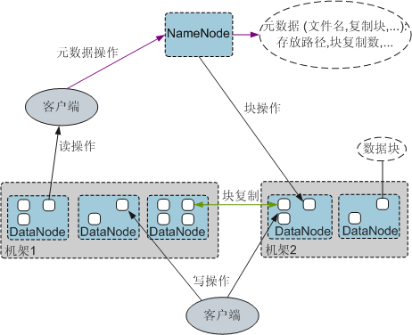

##### 1.1.4 与其他组件的关系

- HDFS和HBase的配合关系

HBase是Apache的Hadoop项目的子项目，HBase利用Hadoop HDFS作为其文件存储系统。HBase位于结构化存储层，Hadoop HDFS为HBase提供了高可靠性的底层存储支持。HBase中的所有数据文件都可以存储在Hadoop HDFS文件系统上，除了HBase产生的一些日志文件。

- MapReduce和HDFS的配合关系

HDFS是hadoop 分布式文件系统，具有高容错性的特点，可以用来部署在低廉的硬件上，它提供了高吞吐量的特性，用来访问应用程序的数据，适合有超大数据集的应用程序。
而MapReduce是一种编程模型，用于大数据集（大于1TB）的并行运算。在MapReduce程序中计算的数据可以来自多个数据源，如local File、HDFS、数据库等。最常用的是HDFS，可以利用HDFS的高吞吐性能读取大规模的数据进行计算。同时在计算完成后，也可以将数据存储到HDFS。
对比Spark，MapReduce读取HDFS数据或者存储数据到HDFS中都相对简单。当MapReduce运行Task时，会基于用户编写的业务逻辑进行读取或存储数据。

- Spark和HDFS的配合关系

通常，Spark中计算的数据可以来自多个数据源，如local File、HDFS等。最常用的是HDFS，可以一次读取大规模的数据进行并行计算。在计算完成后，也可以将数据存储到HDFS。


##### 1.1.5 参考文档：

http://hadoop.apache.org/docs/current/hadoop-project-dist/hadoop-hdfs/HdfsDesign.html


#### 2.Hbase

#### 2.1  基本原理

##### 功能

HBase是一个高可靠性、高性能、面向列、可伸缩的分布式存储系统。HBase适合于存储大表数据（表的规模可以达到数十亿行以及数百万列），并且对大表数据的读、写访问可以达到实时级别。

- 利用Hadoop HDFS（Hadoop Distributed File System）作为其文件存储系统，提供高可靠性、高性能、列存储、可伸缩、实时读写的数据库系统。
- 利用Spark和Hadoop MapReduce来处理HBase中的海量数据。
- 利用ZooKeeper作为协同服务。

##### 结构

HBase集群由主备Master进程和多个RegionServer进程组成。如图所示。

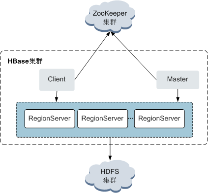

| 名称           | 说明                                       |
| ------------ | ---------------------------------------- |
| Master       | 又叫HMaster，在HA模式下，包含主用Master和备用Master。主用Master：负责HBase中RegionServer的管理，包括表的增删改查；RegionServer的负载均衡，Region分布调整；Region分裂以及分裂后的Region分配；RegionServer失效后的Region迁移等。备用Master：当主用Master故障时，备用Master将取代主用Master对外提供服务。故障恢复后，原主用Master降为备用。 |
| Client       | Client使用HBase的RPC机制与Master、RegionServer 进行通信。Client与Master进行管理类通信，与RegionServer进行数据操作类通信。 |
| RegionServer | RegionServer负责提供表数据读写等服务，是HBase的数据处理和计算单元。RegionServer一般与HDFS集群的DataNode合并。实现数据的存储功能。 |
| ZooKeeper集群  | ZooKeeper为HBase集群中各进程提供分布式协作服务。各RegionServer将自己的信息注册到Zookeeper中，Master据此感知各个RegionServer的健康状态。 |
| HDFS集群       | HDFS为HBase提供高可靠的文件存储服务，HBase的数据全部存储在HDFS中。 |

##### 原理

- HBase数据模型

  HBase以表的形式存储数据，数据模型如图所示。表中的数据划分为多个Region，并由Master分配给对应的RegionServer进行管理。

  每个Region包含了表中一段Row key区间范围内的数据，HBase的一张数据表开始只包含一个Region，随着表中数据的增多，当一个Region的大小达到容量上限后会分裂成两个Region。您可以在创建表时定义Region的Row key区间，或者在配置文件中定义Region的大小。

   HBases数据模型：
  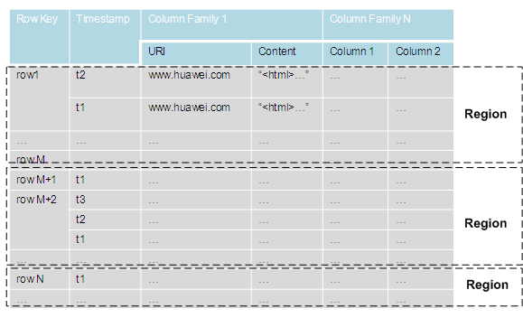

  ​

  ​

  | 名称            | 说明                                       |
  | ------------- | ---------------------------------------- |
  | Row Key       | 行键，相当于关系表的主键，每一行数据的唯一标识。字符串、整数、二进制串都可以作为RowKey。所有记录按照RowKey排序后存储。 |
  | Timestamp     | 每次数据操作对应的时间戳，数据按时间戳区分版本，每个Cell的多个版本的数据按时间倒序存储。 |
  | Column Family | 列族，一个表在水平方向上由一个或多个Column Family组成。一个CF（Column Family）可以由任意多个Column组成。Column是CF下的一个标签，可以在写入数据时任意添加，因此CF支持动态扩展，无需预先定义Column的数量和类型。HBase中表的列非常稀疏，不同行的列的个数和类型都可以不同。此外，每个CF都有独立的生存周期（TTL）。可以只对行上锁，对行的操作始终是原始的。 |
  | Column        | 列。与传统的数据库类似，HBase的表中也有列的概念，列用于表示相同类型的数据。 |

- RegionServer数据存储

  RegionServer主要负责管理由HMaster分配的Region，RegionServer的数据存储结构如图所示。

  RegionServer的数据存储结构：
  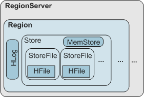

  ​

  | 名称        | 描述                                       |
  | --------- | ---------------------------------------- |
  | Store     | 一个Region由一个或多个Store组成，每个Store对应[图3-5](http://support.huawei.com/view/contentview!getFileStream.action?mid=SUPE_DOC&viewNid=EDOC1000061622&nid=EDOC1000061622&partNo=j006&type=htm#zh-cn_topic_0007528610_zh-cn_topic_0006551568_fig31457179164049)中的一个Column Family。 |
  | MemStore  | 一个Store包含一个MemStore，MemStore缓存客户端向Region插入的数据，当RegionServer中的MemStore大小达到配置的容量上限时，RegionServer会将MemStore中的数据“flush”到HDFS中。 |
  | StoreFile | MemStore的数据“flush”到HDFS后成为StoreFile，随着数据的插入，一个Store会产生多个StoreFile，当StoreFile的个数达到配置的最大值时，RegionServer会将多个StoreFile合并为一个大的StoreFile。 |
  | HFile     | HFile定义了StoreFile在文件系统中的存储格式，它是当前HBase系统中StoreFile的具体实现。 |
  | HLog      | HLog日志保证了当RegionServer故障的情况下用户写入的数据不丢失，RegionServer的多个Region共享一个相同的HLog。 |

- 元数据表

  元数据表是HBase中一种特殊的表，用来帮助Client定位到具体的Region。包括“.META.”表和“-ROOT-”表。

  - “.META.”表：记录用户表的Region信息，例如，Region位置、起始Row Key及结束Row Key等信息。
  - “-ROOT-”表：记录了“.META.”表的Region信息。“-ROOT-”表不会分裂，因此只有一个Region包含“-ROOT-”表。

  元数据表和用户表的映射关系如图所示。

  元数据表和用户表的映射关系：
  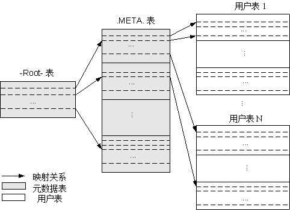

- 数据操作流程

  HBase数据操作流程如图所示。

  数据操作流程：
  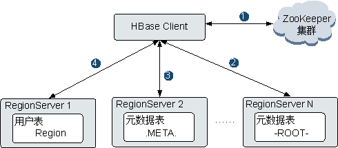

  1. 当对HBase进行增、删、改、查数据操作时，HBase Client首先连接ZooKeeper获得“-ROOT-”表所在的RegionServer的信息。
  2. HBase Client连接到“-ROOT-”表的Region所在的RegionServer，并获得“.META.”表的Region的信息。
  3. HBase Client连接到包含对应的“.META.”表的Region所在的RegionServer，并获得相应的用户表的Region所在的RegionServer位置信息。
  4. HBase Client连接到对应的用户表Region所在的RegionServer，并将数据操作命令发送给该RegionServer，RegionServer接收并执行该命令从而完成本次数据操作。

  为了提升数据操作的效率，HBase Client会在内存中缓存“-ROOT-”、“.META.”和用户表Region的信息，当应用程序发起下一次数据操作时，HBase Client会首先从内存中获取这些信息；当未在内存缓存中找到对应数据信息时，HBase Client会重复上述操作。

#### 2.2 与组件的关系

##### 2.2.1 HDFS和HBase的配合关系

HBase利用Hadoop HDFS作为其文件存储系统。HBase位于结构化存储层，Hadoop HDFS为HBase提供了高可靠性的底层存储支持。HBase中的所有数据文件都可以存储在Hadoop HDFS文件系统上，除了HBase产生的一些日志文件。


#### 3.Hive

##### 3.1 基本原理

##### 3.1.1 功能


Hive是建立在Hadoop上的数据仓库框架，提供类似SQL的Hive QL语言操作结构化数据，其基本原理是将HQL语言自动转换成MapReduce任务（或可配置为Tez引擎或Spark引擎来执行任务），从而完成对Hadoop集群中存储的海量数据进行查询和分析。

Hive主要特点如下：

- 海量结构化数据分析汇总。

- 将复杂的MapReduce编写任务简化为SQL语句。

- 灵活的数据存储格式，支持JSON，CSV，TEXTFILE，RCFILE，SEQUENCEFILE,ORC,PARQUET等存储格式。

  ​

##### 3.1.2 结构


Hive为单实例的服务进程，提供服务的原理是将HQL编译解析成相应的MapReduce任务（或者Spark、Tez任务），Hive的结构概图。

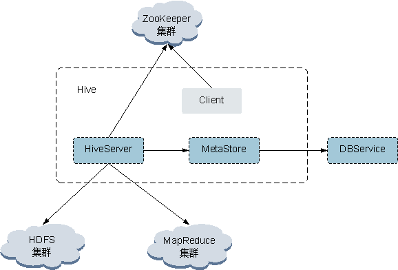


| 角色          | 描述                                       |
| ----------- | ---------------------------------------- |
| HiveServer  | 在HA模式下，包含主用HiveServer和备用HiveServer。主用HiveServer：对外提供Hive数据库服务，将用户提交的HQL语句进行编译，解析成对应的MR任务或者HDFS操作，从而完成数据的提取、转换、分析。备用HiveServer：当主用HiveServer故障时，备用HiveServer将取代主用HiveServer对外提供服务。 |
| MetaStore   | 提供Hive的元数据服务，负责Hive表的结构和属性信息读、写、维护和修改。   |
| ZooKeeper集群 | ZooKeeper为HiveServer的HA机制提供仲裁。各HiveServer将自己的信息注册到Zookeeper中，为客户端访问主HiveServer提供依据 |
| HDFS集群      | Hive表数据存储在HDFS集群中。                       |
| MR集群        | 提供分布式计算服务：Hive的大部分数据操作依赖MapReduce，HiveServer的主要功能是将HQL语句转换成MR任务，从而完成对海量数据的处理。 |


##### 3.1.3 原理

Hive作为一个基于hdfs和mapreduce架构的数据仓库，其主要能力是通过对HQL（Hive Query Language）编译和解析，生成并执行相应的mapreduce任务或者hdfs操作。

**• Metastore **– 对表，列和Partition等的元数据进行读写及更新操作，其下层为关系型数据库。

**• Driver **– 管理HiveQL执行的生命周期并贯穿Hive任务整个执行期间。

• **Compiler** – 编译HiveQL并将其转化为一系列相互依赖的Map/Reduce任务

• **Optimizer** – 优化器，分为逻辑优化器和物理优化器，分别对HiveQL生成的执行计划和MapReduce任务进行优化。

• **Executor** – 按照任务的依赖关系分别执行Map/Reduce任务

• **ThriftServer** – 提供thrift接口，作为JDBC和ODBC的服务端，并将Hive和其他应用程序集成起来。

• **Clients **– 包含命令行接口(CLI), the web UI 和JDBC/ODBC 接口，为用户访问提供接口。


##### 3.1.4 与组件的关系

##### Hive与HDFS间的关系

Hive是Apache的Hadoop项目的子项目，Hive利用Hadoop HDFS作为其文件存储系统。Hive通过解析和计算处理结构化的数据，Hadoop HDFS则为Hive提供了高可靠性的底层存储支持。Hive数据库中的所有数据文件都可以存储在Hadoop HDFS文件系统上,Hive所有的数据操作也都是通过Hadoop HDFS接口进行的。

##### Hive与MapReduce间的关系

Hive所有的数据计算都依赖于MapReduce 。MapReduce也是Apache的Hadoop项目的子项目，它是一个基于Hadoop HDFS分布是并行计算框架。Hive对数据的分析时，会将用户提交的HQL语句解析成响应的MapReduce任务并提交MapReduce执行。

##### Hive与MySQL间的关系

Hive的MetaStore（元数据服务）处理Hive的数据库、表、分区等的结构和属性信息，这些信息需要存放在一个关系型数据库中，由MetaStore维护和处理。在数栖平台产品中，这个关系型数据库由MySQL组件维护。


#### 3.2 数栖平台实践

数栖平台将自动优化查询语句，加上条数限制条件，并提供结果表格展示，及查询结果下载功能。


### 二、数栖平台基础组件调度层

 

#### 4.Yarn

##### 4.1 基本原理

##### 4.1.1 功能

YARN是Hadoop 2.0中的资源管理系统，它是一个通用的资源模块，可以为各类应用程序进行资源管理和调度。YARN不仅仅局限于MapReduce一种框架使用，也可以供其他框架使用，比如Tez、Spark、Storm等。YARN类似于几年前的资源管理系统Mesos和更早的Torque。由于YARN的通用性，下一代的MapReduce核心已经从简单的支持单一应用的计算框架MapReduce转移到通用的资源管理系统YARN。


##### 4.1.2 结构

YARN模型主要由ResourceManager、ApplicationMaster和NodeManager组成
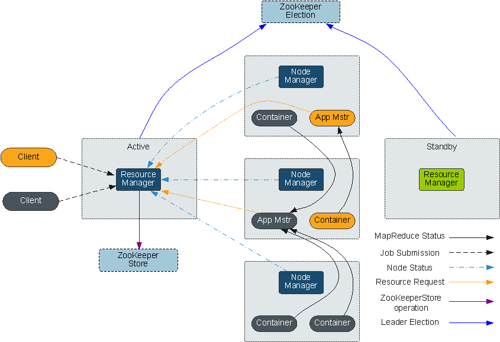


| 角色                    | 描述                                       |
| --------------------- | ---------------------------------------- |
| Client                | YARN application客户端，可以通过客户端向ResourceManager提交任务，查询application运行状态等。 |
| ResourceManager(RM)   | 集群的资源管理器，基于应用程序对资源的需求进行调度。资源管理器提供一个调度策略的插件，它负责将集群资源分配给多个队列和应用程序。调度插件可以基于现有的能力调度和公平调度模型。 |
| NodeManager（NM）       | 负责执行应用程序的容器，同时监控应用程序的资源使用情况（CPU，内存，硬盘，网络）并且向ResourceManager汇报。 |
| ApplicationMaster(AM) | 即图中的App Mstr，负责相应的调度和协调，结合从ResourceManager获得的资源和NodeManager协同工作来运行和监控任务。 |
| Container             | 作为资源隔离，当前仅仅提供java虚拟机CPU、内存的隔离。           |


##### 4.1.3 原理

新的Hadoop MapReduce框架命名为MapReduceV2或者叫YARN。YARN主要分为ResourceManager、ApplicationMaster与NodeManager三个部分。

- ResourceManager是一个中心的服务，负责调度、启动每一个Job所属的ApplicationMaster、同时监控ApplicationMaster的运行情况。ResourceManager负责作业与资源的调度，并接收JobSubmitter提交的作业，按照作业的上下文(Context)信息，以及从NodeManager收集来的状态信息，启动调度过程，分配一个Container作为ApplicationMaster。
- NodeManager功能比较专一，就是负责Container状态的维护，并向ResourceManager保持心跳。
- ApplicationMaster负责一个Job生命周期内的所有工作，类似MapReduceV1中JobTracker。但注意每一个Job（不是每一种）都有一个ApplicationMaster，它可以运行在ResourceManager以外的机器上。

#### 4.2 与组件的关系


##### Spark和YARN的配合关系

Spark的计算调度方式，可以通过YARN的模式实现。Spark享受YARN集群提供丰富的计算资源，将任务分布式的运行起来。Spark on YARN 分两种模式：yarn-cluster和yarn-client。

##### MapReduce和YARN的配合关系

MRv2（MapReduce v2）具有与MRv1相同的编程模型和数据处理引擎，唯一不同的是运行时环境。MRv2是在MRv1上经过加工之后，运行于资源管理框架YARN之上的计算框架MapReduce。它的运行环境不再由JobTracker和TaskTracker等服务组成，而是变为通用的资源管理系统YARN和作业控制进程ApplicationMaster，其中，YARN负责资源管理调度，而ApplicationMaster仅负责一个作业的管理。

简而言之，MapReduce（MRv2）是运行在YARN之上的一个批处理的计算框架。

#### 4.3 数栖平台实践

数栖平台在yarn在划分了多个队列，以供不同的工作空间使用。例如划分成生产队列和开发队列，在定时调度任务凌晨运行时，可以保证生产队列有资源供任务正常调度运行。同时，开发队列也能保证生产任务在运行时，预留资源给开发人员进行开发调试。


### 二、数栖平台基础组件计算层


数栖平台底层计算主要分为Spark、Spark SQL 、Hive为主的离线计算引擎；Presto为主的即席计算，提供快速查询服务。以及以Flink、Spark Steaming、Structured Streaming 为主的实时计算功能。


#### Spark & Spark SQL

##### 基本原理

###### 功能

Spark是基于内存进行计算的分布式计算框架。在迭代计算的场景下，数据处理过程中的数据都会存储在内存中，从而避免了MapReduce计算框架中的问题。Spark能够使用Hadoop HDFS，使用户能够快速的从MapReduce切换到Spark计算平台上去；并且提供比MapReduce高10到100倍的性能。Spark作为计算引擎，还支持小批量流式处理、离线批处理、SQL查询、数据挖掘，避免用户在这几类不同的系统中加载同一份数据带来的存储和性能上的开销。

Spark的特点如下：

- 支持分布式内存计算
- 支持迭代式的计算
- 兼容Hadoop系统文件读写方式
- 计算过程容错
- 支持多种语言开发应用(Scala/Java/Python)
- 计算能力线性扩展

###### 结构


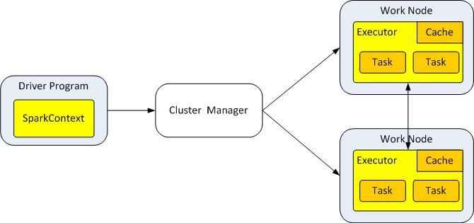

| 角色              | 描述                                       |
| --------------- | ---------------------------------------- |
| Cluster Manager | 集群管理器。Spark支持多种集群管理器，Spark自带的standalone集群管理器、Mesos或YARN。 |
| Driver Program  | Spark应用程序运行时包含一个Driver进程，也是应用程序的主进程，负责应用程序的解析、生成Stage并调度Task到Executor上。 |
| Executor        | 即真正执行应用程序的地方，一个集群一般包含多个Executor，每个Executor接收Driver的命令Launch Task，一个Executor可以执行一到多个Task。 |
| Master Node     | 集群的主节点，负责接收客户端提交的作业，管理Worker，并命令Worker启动Driver和Executor。 |
| Work Node       | 负责运行集群中Spark的应用程序。负责管理本节点的资源，定期向Master汇报心跳，接收Master的命令。 |
| SparkContext    | 面向用户的Spark程序入口，是Spark应用程序的总控，负责运用的分布执行计划和Task的调度。是用户基于业务逻辑定义的类，里面包含DAG（无回路有向图）。SparkContaxt会基于用户的业务逻辑，划分stage，并生成Task。 |
| Task            | 承载业务逻辑的运算单元，是Spark平台中可执行的最小工作单元。一个应用根据执行计划以及计算量分为多个Task。 |
| Cache           | 分布式缓存。每个Task可将结果放置于Cache，供多个后续Task读取。    |

##### 原理

Spark的应用运行架构，运行流程如下所示：

1. 应用程序（Application）是作为一个进程的集合运行在集群上的，由驱动程序中的SparkContext对象进行协调。
2. 在运行一个应用时，SparkContext会去连接集群管理器（Standalone、Mesos、YARN）申请运行Executor资源，并启动ExecutorBackend。然后由集群管理器在不同的应用之间调度资源。SparkContext同时会启动应用程序DAG调度、Stage划分、TaskSet生成。
3. 然后Spark会把应用的代码(传递给SparkContext的JAR或者Python定义的代码)发送到Executor上。
4. 所有的Task执行完成后，用户的应用程序运行结束。

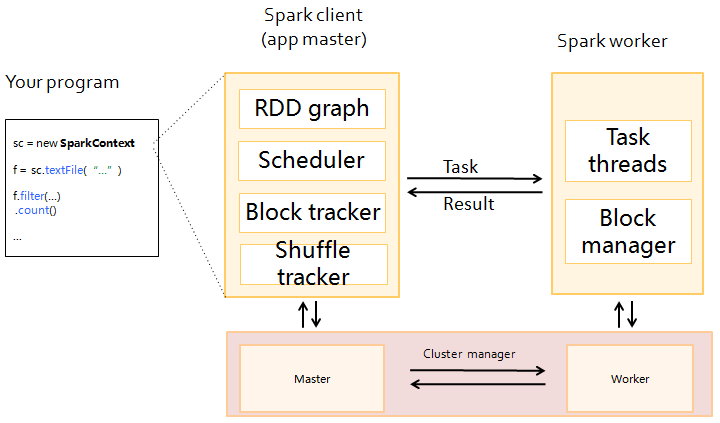


Spark采用Master和worker的模式，如图所示。用户在Spark客户端提交应用程序，调度器将Job分解为多个Task发送到各个Worker中执行，各个Worker将计算的结果上报给Driver，Driver聚合结果返回给客户端。

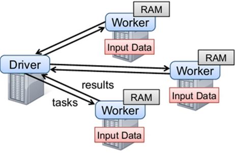

在此结构中，有几个说明点：

- 应用之间是独立的。

  每个应用有自己的executor进程，多线程地执行任务。 无论是在调度方面，或者是executor方面。各个Driver独立调度自己的任务；不同的应用任务运行在不同的JVM上，即不同的Executor。

- 不同Spark应用之间是不共享数据的 ，除非把数据存储在外部的存储系统上(比如HDFS)。

- 因为启动程序在集群上调度任务，所以启动程序最好和worker节点比较近，比如在一个相同的局部网络内。


##### 基本概念

以下为重要概念，可以帮助您减少在学习Spark框架所花费的时间，有助于Spark开发完全聚焦于实际业务。

- RDD

  即弹性分布数据集（Resilient Distributed Dataset），是Spark的核心概念。指的是一个只读的，可分区的分布式数据集，这个数据集的全部或部分可以缓存在内存中，在多次计算间重用。

  **RDD的生成：**

  - 从Hadoop文件系统（或与Hadoop兼容的其它存储系统）输入创建（例如HDFS） 。
  - 从父RDD转换得到新RDD。

  **RDD的存储：**

  - 用户可以选择不同的存储级别存储RDD以便重用（RDD有11种存储级别）。
  - 当前RDD默认是存储于内存，但当内存不足时，RDD会溢出到磁盘中。

- Dependency（RDD的依赖）

  RDD的数据结构里很重要的一个域是对父RDD的依赖。 两类依赖分别为：窄依赖和宽依赖。

  ​


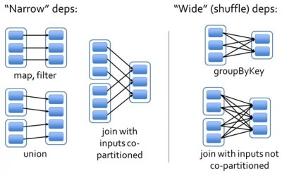

​    

- **窄依赖：**指父RDD的每一个分区最多被一个子RDD的分区所用，表现为一个父RDD的分区对应于一个子RDD的分区，和两个父RDD的分区对应于一个子RDD的分区。上图中，map/filter和union属于第一类，对输入进行协同划分（co-partitioned）的join属于第二类。
  - **宽依赖：**指子RDD的分区依赖于父RDD的所有分区，这是因为shuffle类操作，如上图中的groupByKey和未经协同划分的join。

  窄依赖对优化很有利。逻辑上，每个RDD的算子都是一个fork/join（此join非上文的join算子，而是指同步多个并行任务的barrier）： 把计算fork到每个分区，算完后join，然后fork/join下一个RDD的算子。如果直接翻译到物理实现，是很不经济的：一是每一个RDD（即使是中间结果）都需要物化到内存或存储中，费时费空间；二是join作为全局的barrier，是很昂贵的，会被最慢的那个节点拖死。如果子RDD的分区到父RDD的分区是窄依赖，就可以实施经典的fusion优化，把两个fork/join合为一个；如果连续的变换算子序列都是窄依赖，就可以把很多个 fork/join并为一个，不但减少了大量的全局barrier，而且无需物化很多中间结果RDD，这将极大地提升性能。Spark把这个叫做流水线 （pipeline）优化。

- Transformation和Action（RDD的操作）

  对RDD的操作包含Transformation（返回值还是一个RDD）和Action（返回值不是一个RDD）两种。RDD的操作流程如图所示。其中Transformation操作是Lazy的，也就是说从一个RDD转换生成另一个RDD的操作不是马上执行，Spark在遇到Transformations操作时只会记录需要这样的操作，并不会去执行，需要等到有Actions操作的时候才会真正启动计算过程进行计算。Actions操作会返回结果或把RDD数据写到存储系统中。Actions是触发Spark启动计算的动因。


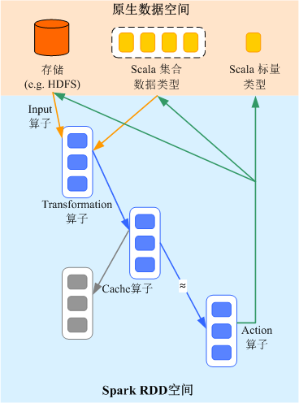


- Transformation操作可以分为如下几种类型：

  - 视RDD的元素为简单元素。

    输入输出一对一，且结果RDD的分区结构不变，主要是map。

    输入输出一对多，且结果RDD的分区结构不变，如flatMap（map后由一个元素变为一个包含多个元素的序列，然后展平为一个个的元素）。

    输入输出一对一，但结果RDD的分区结构发生了变化，如union（两个RDD合为一个，分区数变为两个RDD分区数之和）、coalesce（分区减少）。

    从输入中选择部分元素的算子，如filter、distinct（去除重复元素）、subtract（本RDD有、它RDD无的元素留下来）和sample（采样）。

  - 视RDD的元素为Key-Value对。

    对单个RDD做一对一运算，如mapValues（保持源RDD的分区方式，这与map不同）；

    对单个RDD重排，如sort、partitionBy（实现一致性的分区划分，这个对数据本地性优化很重要）；

    对单个RDD基于key进行重组和reduce，如groupByKey、reduceByKey；

    对两个RDD基于key进行join和重组，如join、cogroup。

    说明：

    后三种操作都涉及重排，称为shuffle类操作。

  **Action操作可以分为如下几种：**

  - 生成标量，如count（返回RDD中元素的个数）、reduce、fold/aggregate（返回几个标量）、take（返回前几个元素）。
  - 生成Scala集合类型，如collect（把RDD中的所有元素倒入 Scala集合类型）、lookup（查找对应key的所有值）。
  - 写入存储，如与前文textFile对应的saveAsTextFile。
  - 还有一个检查点算子checkpoint。当Lineage特别长时（这在图计算中时常发生），出错时重新执行整个序列要很长时间，可以主动调用 checkpoint把当前数据写入稳定存储，作为检查点。

- **Shuffle**

  Shuffle是MapReduce框架中的一个特定的phase，介于Map phase和Reduce phase之间，当Map的输出结果要被Reduce使用时，输出结果需要按key哈希，并且分发到每一个Reducer上去，这个过程就是shuffle。由于shuffle涉及到了磁盘的读写和网络的传输，因此shuffle性能的高低直接影响到了整个程序的运行效率。

  下图清晰地描述了MapReduce算法的整个流程，其中shuffle phase是介于Map phase和Reduce phase之间。


- Spark Application的结构

  Spark Application的结构可分为两部分：初始化SparkCOntext和主体程序。

  - 初始化SparkContext：构建Spark Application的运行环境。

    构建SparkContext对象，如：

    ```
    new SparkContext(master, appName, [SparkHome], [jars])

    参数介绍：
    master：连接字符串，连接方式有local, yarn-cluster, yarn-client等
    appName：构建的Application名称
    SparkHome：集群中安装Spark的目录
    jars：应用程序代码和依赖包
    ```

  - 主体程序：处理数据

- Spark shell命令

  Spark基本shell命令，支持提交Spark应用。命令为：

  ```
  ./bin/spark-submit \
    --class <main-class>
    --master <master-url> \
    ... # other options
    <application-jar> \
    [application-arguments]

  参数解释：
  --class：Spark应用的类名
  --master：Spark用于所连接的master，如yarn-client，yarn-cluster等
  application-jar：Spark应用的jar包的路径
  application-arguments：提交Spark应用的所需要的参数（可以为空）。
  ```

- Spark Web UI界面

  用于监控正在运行的或者历史的Spark作业在Spark框架各个阶段的细节以及提供日志显示，帮助用户更细粒度地去开发、配置和调优作业。


##### 与组件的关系

 Spark和HDFS的配合关系

通常，Spark中计算的数据可以来自多个数据源，如local File、HDFS等。最常用的是HDFS，可以一次读取大规模的数据进行并行计算。在计算完成后，也可以将数据存储到HDFS。

分解来看，Spark分成控制端(Driver)和执行端（Executor）。控制端负责任务调度，执行端负责任务执行。读取文件的过程如图所示。

读取文件过程
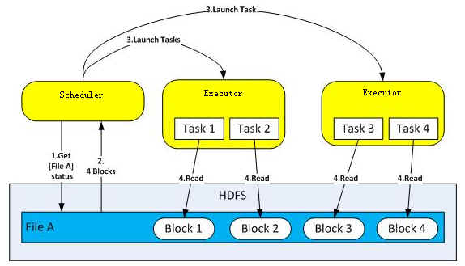

- 读取文件步骤的详细描述如下所示：
  1. SparkScheduler与HDFS交互获取File A的文件信息。
  2. HDFS返回该文件具体的Block信息。
  3. SparkScheduler根据具体的Block数据量，决定一个并行度，创建多个Task去读取这些文件Block。
  4. 在Executor端执行Task并读取具体的Block，作为RDD(弹性分布数据集)的一部分。
- HDFS文件写入的详细步骤如下所示：
  1. SparkScheduler创建要写入文件的目录。
  2. 根据RDD分区分块情况，计算出写数据的Task数，并下发这些任务到Executor。
  3. Executor执行这些Task，将具体RDD的数据写入到步骤1创建的目录下。

##### Spark和YARN的配合关系

Spark的计算调度方式，可以通过YARN的模式实现。Spark享受YARN集群提供丰富的计算资源，将任务分布式的运行起来。Spark on YARN 分两种模式：yarn-cluster和yarn-client。

- YARN Cluster模式

  运行框架如图所示。

    Spark on yarn-cluster 运行框架：
  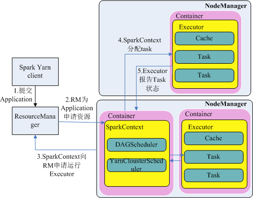

  Spark on yarn-cluster 实现流程：

  1. 首先由客户端生成Application信息，提交给ResourceManage。

  2. ResourceManager为Spark Application分配第一个container，并在指定节点的container上启动SparkContext。

  3. SparkContext向ResourceManager申请资源以运行Executor。

     ResourceManager分配Container给SparkContext，SparkContext和相关的NodeManager通讯，在获得的Container上启动 CoarseGrainedExecutorBackend，CoarseGrainedExecutorBackend启动后，开始向SparkContext注册并申请Task。

  4. SparkContext分配Task给CoarseGrainedExecutorBackend执行。

  5. CoarseGrainedExecutorBackend执行Task并向SparkContext汇报运行状况。

- YARN Client模式

  运行框架如图所示。

    Spark on yarn-client 运行框架
  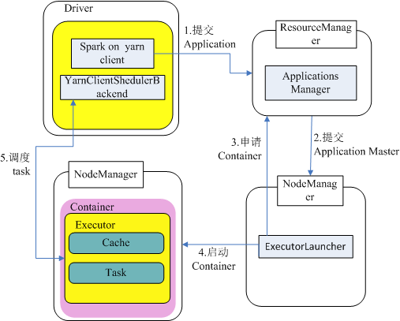

  Spark on yarn-client 实现流程：

  1. 客户端向ResourceManager发送Spark应用提交请求，ResourceManager为其返回应答，该应答中包含多种信息(如ApplicationId、可用资源使用上限和下限等)。client端将启动ApplicationMaster所需的所有信息打包，提交给ResourceManager上。

  2. ResourceManager收到请求后，会为ApplicationMaster寻找合适的节点，并在该节点上启动它。ApplicationMaster是Yarn中的角色，在Spark中进程名字是ExecutorLauncher

  3. 根据每个任务的资源需求，ApplicationMaster可向ResourceManager申请一系列用于运行任务的Container。

  4. 当ApplicationMaster（从ResourceManager端）收到新分配的Container列表后，会向对应的NodeManager发送信息以启动Container。

     ResourceManager分配Container给SparkContext，SparkContext和相关的NodeManager通讯，在获得的Container上启动 CoarseGrainedExecutorBackend，CoarseGrainedExecutorBackend启动后，开始向SparkContext注册并申请Task。

  5. SparkContext分配Task给CoarseGrainedExecutorBackend执行。CoarseGrainedExecutorBackend执行Task并向SparkContext汇报运行状况。


#### 4.3 数栖平台实践

1.解决2.0版本 无法加载Hive永久UDF的bug

2.提供查询结果下载功能。

3.提供PySpark任务，用户可以直接写python代码，处理SQL无法处理的复杂逻辑。

4.提供Spark任务可视化编辑参数，告别繁琐的提交脚本。

5.提供参数


#### Flink

##### 基本原理

##### 功能

Flink是一个开源的分布式流式处理框架：

- 提供准确的结果，甚至在出现无序或者延迟加载的数据的情况下。
- 它是状态化的容错的，同时在维护一次完整的的应用状态时，能无缝修复错误。
- 大规模运行，在上千个节点运行时有很好的吞吐量和低延迟。

更早的时候，我们讨论了数据集类型（有界 vs 无穷）和运算模型（批处理vs流式）的匹配。Flink的流式计算模型启用了很多功能特性，如状态管理，处理无序数据，灵活的视窗，这些功能对于得出无穷数据集的精确结果是很重要的。

Flink保证状态化计算强一致性。”状态化“意味着应用可以维护随着时间推移已经产生的数据聚合或者，并且Filnk的检查点机制在一次失败的事件中一个应用状态的强一致性。

##### 结构


##### 原理

##### 与组件的关系


 

#### 五、数栖平台即席计算

 数栖即席查询引擎依赖于开源组件Presto。

#### Presto

##### 基本原理

##### 功能

Presto是一个开源的分布式SQL查询引擎，适用于交互式分析查询，数据量支持GB到PB字节。

Presto的设计和编写完全是为了解决像Facebook这样规模的商业数据仓库的交互式分析和处理速度的问题。

Presto支持在线数据查询，包括Hive, Cassandra, 关系数据库以及专有数据存储。 一条Presto查询可以将多个数据源的数据进行合并，可以跨越整个组织进行分析。

Presto以分析师的需求作为目标，他们期望响应时间小于1秒到几分钟。 Presto终结了数据分析的两难选择，要么使用速度快的昂贵的商业方案，要么使用消耗大量硬件的慢速的“免费”方案。


##### 结构

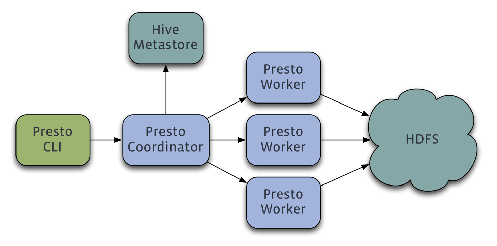

- Presto查询引擎是一个Master-Slave的架构，由下面三部分组成:
- 1. 一个Coordinator节点
  2. 一个Discovery Server节点
  3. 多个Worker节点
- Coordinator: 负责解析SQL语句，生成执行计划，分发执行任务给Worker节点执行
- Discovery Server: 通常内嵌于Coordinator节点中
- Worker节点: 负责实际执行查询任务,负责与HDFS交互读取数据
- Worker节点启动后向Discovery Server服务注册，Coordinator从Discovery Server获得可以正常工作的Worker节点。如果配置了Hive Connector，需要配置一个Hive MetaStore服务为Presto提供Hive元信息

##### 原理

既然Presto是一个交互式的查询引擎，我们最关心的就是Presto实现低延时查询的原理，主要是下面几个关键点。

1. 完全基于内存的并行计算
2. 流水线
3. 本地化计算
4. 动态编译执行计划
5. 小心使用内存和数据结构
6. 类BlinkDB的近似查询
7. GC控制

##### 与组件的关系

1.Presto可使用Hive 的Metastore 服务，直接查询Hive存储在HDFS上的数据。由于Presto出色的性能，在查询Hive表时可以做到快速响应。


#### 四、数栖平台交换技术

数据交换依赖平台在开源同步工具DataX 上进行了进一步封装。

#### DataX

##### 基本原理

##### 功能


 DataX 是一个异构数据源离线同步工具，致力于实现包括关系型数据库(MySQL、Oracle等)、HDFS、Hive、ODPS、HBase、FTP等各种异构数据源之间稳定高效的数据同步功能。


##### 结构

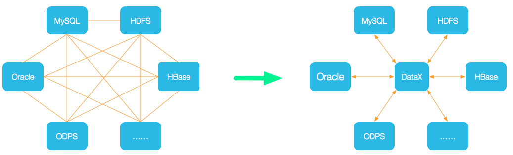

为了解决异构数据源同步问题，DataX将复杂的网状的同步链路变成了星型数据链路，DataX作为中间传输载体负责连接各种数据源。当需要接入一个新的数据源的时候，只需要将此数据源对接到DataX，便能跟已有的数据源做到无缝数据同步。


##### 原理


DataX本身作为离线数据同步框架，采用Framework + plugin架构构建。将数据源读取和写入抽象成为Reader/Writer插件，纳入到整个同步框架中。

- Reader：Reader为数据采集模块，负责采集数据源的数据，将数据发送给Framework。
- Writer： Writer为数据写入模块，负责不断向Framework取数据，并将数据写入到目的端。
- Framework：Framework用于连接reader和writer，作为两者的数据传输通道，并处理缓冲，流控，并发，数据转换等核心技术问题。

##### 


##### 核心模块介绍：

1. DataX完成单个数据同步的作业，我们称之为Job，DataX接受到一个Job之后，将启动一个进程来完成整个作业同步过程。DataX Job模块是单个作业的中枢管理节点，承担了数据清理、子任务切分(将单一作业计算转化为多个子Task)、TaskGroup管理等功能。
2. DataXJob启动后，会根据不同的源端切分策略，将Job切分成多个小的Task(子任务)，以便于并发执行。Task便是DataX作业的最小单元，每一个Task都会负责一部分数据的同步工作。
3. 切分多个Task之后，DataX Job会调用Scheduler模块，根据配置的并发数据量，将拆分成的Task重新组合，组装成TaskGroup(任务组)。每一个TaskGroup负责以一定的并发运行完毕分配好的所有Task，默认单个任务组的并发数量为5。
4. 每一个Task都由TaskGroup负责启动，Task启动后，会固定启动Reader—>Channel—>Writer的线程来完成任务同步工作。
5. DataX作业运行起来之后， Job监控并等待多个TaskGroup模块任务完成，等待所有TaskGroup任务完成后Job成功退出。否则，异常退出，进程退出值非0

##### DataX调度流程：

举例来说，用户提交了一个DataX作业，并且配置了20个并发，目的是将一个100张分表的mysql数据同步到odps里面。 DataX的调度决策思路是：

1. DataXJob根据分库分表切分成了100个Task。
2. 根据20个并发，DataX计算共需要分配4个TaskGroup。
3. 4个TaskGroup平分切分好的100个Task，每一个TaskGroup负责以5个并发共计运行25个Task。


#### 

 

 

 

