<h1> <center>数栖开发平台-帮助文档</center> </h1>

[TOC]

### 1. 平台介绍
#### 1.1 平台概述

数栖开发平台提供从数据同步、数据开发到数据管理的一站式大数据全链路解决方案，支持Hadoop、Spark、Flink、Presto等业界流行的大数据计算引擎，并支持快速扩展。通过此平台可构建PB级别的数据仓库，来实现超大规模数据的资产化。采用“开箱即用"的使用方式，让用户无需再关心底层集群的搭建和运维，能极大提高数据开发和应用的效率。

#### 1.2 基本概念

- 项目

> 项目(Project)是一组任务、脚本、资源、函数的集合，同一租户下，对于不同的业务建议分别创建不同的项目。例如对于地产和金融两个业务，可分别新建estate、finance两个项目。
>
> 本文档已创建默认项目: demo。具体分配给客户的项目时，会以公司名英文名或拼音作为项目名，请知晓。
>
> 例如对于数澜科技(www.dtwave.com)，项目名是: dtwave。

- 环境

> 同一项目下，可创建多个环境进行数据开发，每个环境拥有独立的Hive数据库、Yarn调度队列，甚至不同的Hadoop集群。
>
> 在新建项目时，平台默认创建开发和生产两个环境，开发环境用于用户开发、调试任务，生产环境也即线上环境，系统默认会按天进行周期调度执行任务。生产环境不允许用户直接操作任务、资源和函数，必须在开发环境下进行新建、修改或删除，再经过**提交**、**创建发布包**、**同意发布**三个操作后，才可同步到生产环境。
>
> 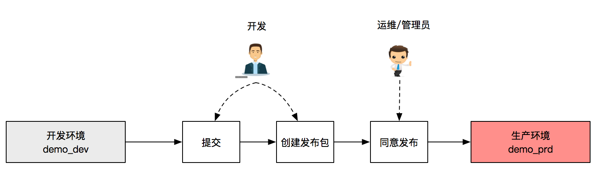
>
> 本文档在demo项目下已创建开发环境(demo_dev)和生产环境(demo_prd)。

- 任务

> 任务(Task)是平台的最小运行单元，目前支持Shell、Hive、Spark、MapReduce、Presto、Flink等12种任务类型。

- 脚本

> 脚本(Script)是一种特殊的任务，用于**一次性**查询或分析数据，因此不支持调度和基线配置。

- 资源

> 资源(Resource)是指用户上传的文件，可被用于任务、脚本和函数开发中。目前支持三种类型的资源文件: jar、txt、python。

- 函数

> 函数(Function)指Hive、Spark、Presto、Flink等系统中的函数。除计算引擎内置的函数外，平台支持用户创建基于Hive的自定义函数(User Defined Function，以下简称UDF)，并可直接用于Hive或SparkSQL类型的任务中。

- 实例

> 实例(Instance)指的是任务实例，任务的每次运行都会产生一个新实例。实例正常运行会经历待运行(Waiting)、运行(Running)、结束(Finished)三个阶段。
>
> 例如对于任务A，两次运行产生的实例ID分别是: T_630_20180301115903046_1、T_630_20180301120009801_1。

### 2. 快速入门 

演示把学生的基础数据导入到Hive表中，并对其进行加工的过程。通过此步骤操作后，用户能简单使用此平台。

#### 2.1 下载数据

学生的基础数据如下，每列分别表示: 用户ID、姓名、年龄、体重，各列之间用 **\t** 分割。

```Txt
1 赵晓丽 23  50
2 王明  25  60
3 王勇  22  55
4 杜孟娟 21  50
5 李志刚 22  56
6 张林静 23  51
```

复制上述数据存储到txt类型的文件中，例如student_info.txt。还可直接在Github下载文件[student_info.txt](https://github.com/dtwave/shuxi/blob/master/data/student/student_info.txt)，如下图2-1-1所示：

<center>图 2-1-1 Github上的学生基础数据</center>

#### 2.2 新建资源

把2.1步骤中的数据文件student_info.txt上传到平台上，作为一种文件资源供后续导入到Hive表中。

1)  新建目录

进入数栖开发平台后，在**开发中心**下的**资源开发**页面，右键点击**资源目录**，选择**新建目录**。如下图2-2-1所示：

 <center>图 2-2-1 新建资源目录(a)</center>

输入目录名称：quick_start，点击**确定**完成。如下图2-2-2所示：<center>图 2-2-2 新建目录(b)</center>

2)  新建资源

右键点击上步创建的quick_start目录，选择新建资源。如图2-2-3所示：

<center>图 2-2-3 新建资源目录(a)</center>

输入资源名: student_info，资源类型: txt，选择文件时添加上面的student_info.txt，点击**确定**完成。如图2-2-4所示：

<center>图 2-2-4 新建资源目录(b)</center>

#### 2.3 新建表

新建Hive表，用于存放学生的基础数据。步骤如下:

1)  创建离线任务目录

在**开发中心**下，点击**离线任务**，右键点击**离线任务目录**，选择**新建目录**。如图2-3-1所示，新建quick_start目录。

           <center>图 2-3-1 新建quick_start目录</center>

2)  创建ddl与job目录

在quick_start目录下，分别创建ddl和job目录。其中ddl目录存放用于创建表的DDL类型任务，job目录则存放其他类型的数据加工任务。如图2-3-2所示：

<center>图 2-3-2 创建ddl与job目录</center>

3)  在ddl目录下创建DDL类型任务，右键单击ddl目录，在弹框中选择**新建离线任务**，如图2-3-3所示: 

<center>图 2-3-3 创建DDL任务</center>

4)  输入任务名称: ddl_quick_start_student_info，任务类型DDL，如图2-3-4所示。ddl目录下的任务命名建议为 ddl\_表名，详见[数据开发-命名规范](https://github.com/dtwave/shuxi/blob/master/doc/%E6%95%B0%E6%A0%96%E6%95%B0%E6%8D%AE%E5%91%BD%E5%90%8D%E8%A7%84%E8%8C%83.md)。

<center>图 2-3-4 创建DDL任务</center>

在ddl_quick_start_student_info任务中，输入如下建表语句。其中**代码注释必须要以 ”--“ 加空格开头**，且为单独一行。

```sql
-- 如果表已存在,可以删除掉.
-- drop table if exists quick_start_student_info;

-- 新建学生表
create table if not exists quick_start_student_info
(
    id      bigint comment 'ID'
  , name    string comment '姓名'
  , age     bigint comment '年龄'
  , weight  bigint comment '体重(kg)'
)
comment '学生基本信息'
row format delimited
fields terminated by'\t' 
lines terminated by'\n'
stored as textfile;
```

5)  点击**运行**来在Hive库开始新建表quick_start_student_info。如图2-3-5所示：

<center>图 2-3-5 创建quick_start_student_info表</center>

运行日志如图2-3-6所示，如果显示**任务运行成功(Finished)**，则创建成功。

<center>图 2-3-6 任务运行日志</center>

#### 2.4 数据导入

把student_info.txt文件资源中的数据导入到Hive表中，步骤如下:

1)  创建导入数据任务

右键点击**job**目录，选择**新建离线任务**，任务名为quick_start_student_info，任务类型为Hive。如图2-4-1所示：

<center>图 2-4-1 创建导入数据任务</center>       

任务新建完成后，输入如下导入数据语句:

```sql
-- 导入学生信息
load data local inpath '{student_info.txt}' overwrite into table quick_start_student_info;

-- 预览数据(支持选中执行)
select * from quick_start_student_info limit 10;
```

2)  运行

运行前需要在**属性配置**里设置**资源依赖**，选择student_info.txt资源。然后点击**运行**，执行数据导入语句。如图2-4-3所示：

 <center>图 2-4-2 数据导入</center>

​ 运行日志部分如图2-4-3所示，如果出现**任务运行成功(Finished)**，则表示导入数据成功。导入成功后，也可只选中上述的select语句（选中整行）后，点击运行来预览数据。

<center>图 2-4-3 运行日志</center>

#### 2.5 数据加工

1)  创建数据加工任务。

右键点击**job**目录，选择**新建离线任务**，任务为quick_start_student_statistics，任务类型为SparkSQL，点击**确定**。如图2-5-1所示：

 <center>图 2-5-1 创建数据加工任务</center>


输入如下的 数据加工语句:

```sql
-- 1. 查询学生基本信息
select
         id
       , name
       , age
       , weight
from quick_start_student_info
order by age;

-- 2. 查询学生最大年龄、最小体重
select
      max(age)
    , min(weight)
from quick_start_student_info;
```

2)  运行

<center>图 2-5-2 运行数据加工任务</center>

每条select语句会产生一个运行结果，因此在未选中执行情况下(相当于全选)，运行后会产生两个运行结果。点击**运行结果1**、**运行结果2**，可查询到计算结果。

<center>图 2-5-3 运行日志</center>

### 3. 用户操作手册

本平台主要包含六大模块，分别是开发中心、发布中心、运维中心、监控管理、数据管理和项目管理。各模块的功能依次如下文介绍。

#### 3.1 开发中心

开发中心提供可视化的界面进行任务、资源、函数的开发、运行、提交等操作，同时可对任务进行调度、依赖、基线配置。因生产环境的任务只能查看而不能编辑，因此下面的操作均在开发环境demo_dev下执行。

##### 3.1.1 任务操作
###### 3.1.1.1 新建

在**开发中心**下，点击**离线任务**，选择**离线任务目录**，右击目录，选择**新建离线任务**，输入自定义任务名称，选择任务类型，点击**确定**，完成任务创建。

如下图3-1-1-1所示，新建SparkSQL类型的任务quick_start_student_statistics，然后在代码框输入本文**2.5 数据加工**中的代码，结果见上图2-5-2。

<center>图 3-1-1-1 创建离线任务</center>

###### 3.1.1.2 复制

在指定任务上右键单击后，选择复制，新任务名默认为**原任务名_copy**，用户也可自定义。如图3-1-1-2、 3-1-1-3所示:

<center>图 3-1-1-2 复制离线任务</center>

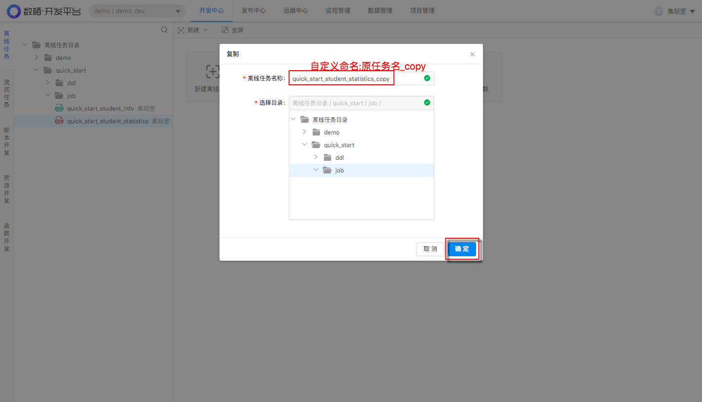<center>图 3-1-1-3 复制离线任务</center>

###### 3.1.1.3 删除

右击要删除的任务，选择**删除离线任务**，点击**确定**，完成删除。如图3-1-1-4、3-1-1-5 所示：

<center>图 3-1-1-4 删除离线任务</center>

<center>图 3-1-1-5 删除离线任务</center>

###### 3.1.1.4 格式化

格式化语句，选中想要格式化的一条完整SQL语句，点击**格式化**。如图3-1-1-6所示：

<center>图 3-1-1-6 格式化语句</center>

###### 3.1.1.5 代码检查

选中需要检查语句，点击**代码检查**，进行语法校验，目前只支持SQL的语法校验。如图3-1-1-7所示：

<center>图 3-1-1-7 代码检查</center>

###### 3.1.1.6 运行

直接点击**运行**按钮会运行所有语句。当需要运行某一语句时，选中要执行的语句，点击**运行**即可。如图3-1-1-8所示：

 <center>图 3-1-1-8 运行</center>

##### 3.1.2 属性配置

###### 3.1.2.1 运行参数 

- 用户自定义参数

  在**属性配置**—>**运行参数**中自定义任务参数，左侧是变量名，右侧是变量值。然后在代码中使用**${变量名}**即可，运行时会自动把变量名替换为变量值。

  如图3-1-2-1所示，定义变量名limitNum的值是10，运行任务quick_start_student_info时自动会把 ${limitNum}替换为10。

  <center>图3-1-2-1 用户自定义参数</center>

- 系统参数

  系统参数是系统自带的默认参数，目前只支持参数bizDate，是指业务日期(前一天)。例如：今天日期为"2018-02-21"，则业务日期bizDate="20180220"。在生产环境中，当任务在每天的周期调度过程中，系统自动会把bizDate替换为前一天的值。

###### 3.1.2.2 依赖配置

依赖配置包含**资源依赖**和**任务依赖**(上游任务)两种，前者选择此任务需要用到的资源，后者则是配置此任务的上游任务。在代码中使用**{资源名}**便可引用此资源， 例如选择的资源依赖是student_info.txt（支持多个资源依赖），则在代码中使用{student_info.txt}即可。

```sql
-- 导入学生信息
load data local inpath '{student_info.txt}' overwrite into table quick_start_student_info;
```

每个任务可以配置一个或多个上游任务，当所有的上游任务都运行完成且到达当前任务的调度时间后，此任务才会被开始调度。每个任务在提交前，必须至少配置一个上游任务，每个项目默认会自带一个根任务bid_root。

资源依赖、任务依赖配置如图3-1-2-2 所示，其中设置quick_start_student_info的父任务为bid_root。

<center>图 3-1-2-2 依赖配置</center>

也可点击**设置上游任务依赖**，采用图形化的界面配置此任务上游任务依赖，在搜索任务框中选择任务，点击**设为上游任务**即可，结果如下图3-1-2-3所示。

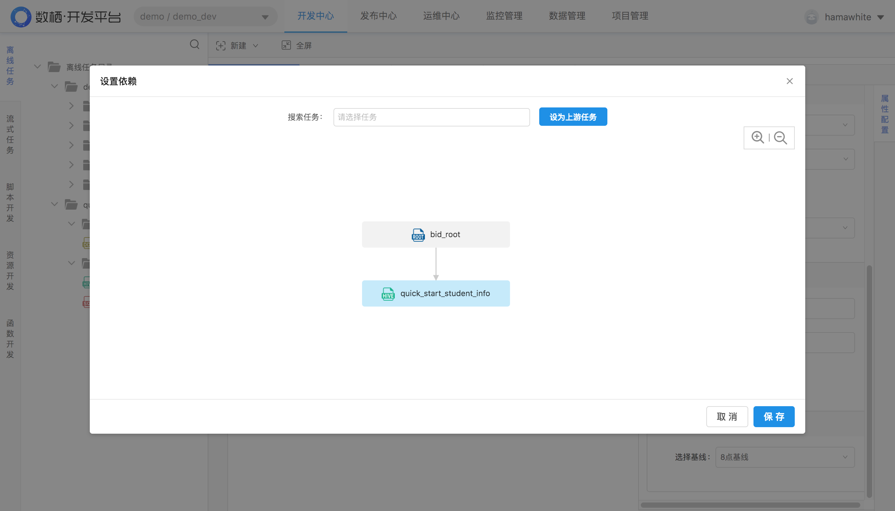

<center>图 3-1-2-3 依赖任务配置</center>

###### 3.1.2.3 调度配置

- 正常调度

  正常调度下包含天、周、月三种粒度的调度周期，不同粒度调度周期之间支持相互依赖。调度时间即任务开始运行时间，配置原则通常建议为集群常规空闲时间，一般为凌晨2点到8点。

  当任务到达调度时间时，如果上游有未完成的任务，则此任务不会被调度。只有当所有上游任务都完成后，此任务才会被调度开始运行。

  <center>图 3-1-2-4 跨周期调度</center>

- 暂停调度

  任务配置**暂定调度**后，则在每天的周期调度中，此任务不会被系统所调度。任务配置**暂定调度**时，**要求此任务不能有下游任务**。

  目前开发环境demo_dev默认未开启周期调度，因此此配置对开发环境并不生效。当任务经过提交、发布到生产环境demo_prd后，此任务每天则不会被周期调度执行。

  <center>图 3-1-2-5 暂停调度</center>

###### 3.1.2.4 基线配置

基线介绍详见**3.4.1 基线管理**。在**属性配置**—>**基线配置**中选择基线。如图3-1-2-6 所示，给任务配置已定义好的"8点基线"。

<center>图 3-1-2-6 基线配置</center>

##### 3.1.3 提交

任务在开发环境(dtwave_dev)中测试无误后，且必须至少配置一个上游任务。然后点击**提交**把任务提交到**发布中心**中，在**发布中心**-->**创建发布包** 列表中会增加一条待发布记录。需要注意的是资源上传后，系统会默认提交。

在提交任务前，请先配置下列任务的依赖关系(下文演示**发布中心**依赖此步操作):

- ddl_quick_start_student_info，父任务是bid_root。
- quick_start_student_info，父任务是bid_root。
- quick_start_student_statistics，父任务是quick_start_student_info。

下图3-1-3表示提交任务quick_start_student_statistics:

<center>图 3-1-3 提交任务</center> 

##### 3.1.4 任务类型

下面每种任务类型仅供测试使用，不需要每天周期调度执行，因此统一存放到**开发中心**—>**脚本开发**中的tmp目录下，且所有任务命名以tmp_开头。

###### 3.1.4.1 Shell

Shell类型用于书写shell。新建tmp_shell脚本，输入下述测试代码，并配置运行参数name。详情如下图3-1-4-1所示。

```shell
echo "数栖开发平台"

# 自定义运行参数
echo "Hello, my name is "${name}

# 输出系统时间
date
```


<center>图 3-1-4-1 Shell任务</center>

###### 3.1.4.2 DataSync

(**新建待细化**)DataSync类型用于数据同步或数据交换，目的是把数据从一个数据源中同步到另一个数据源。例如把Mysql库中表demo_complaint_data同步到Hive库的demo_ods_complaint_data_d表中。任务详情如下图3-1-4-2所示。

<center>图 3-1-4-2 DataSync任务</center>

###### 3.1.4.3 Hive

Hive类型用于书写Hive SQL。新建tmp_hive脚本，输入本文**2.5 数据加工**中的代码，详情如下图3-1-4-3所示。

<center>图 3-1-4-3 Hive任务</center>

###### 3.1.4.4 SparkSQL

Spark SQL类型用于书写Spark SQL。新建tmp_spark_sql脚本，输入本文**2.5 数据加工**的代码，详情如下图3-1-4-4所示。

<center>图 3-1-4-4 SparkSQL任务</center>

###### 3.1.4.5 Python

Python类型用于书写Python代码。新建tmp_python脚本，详情如下图3-1-4-5所示。

<center>图 3-1-4-5 Python任务</center>

###### 3.1.4.6 PySpark

PySpark类型用于书写Python Spark 代码。新建tmp_python_spark_sql脚本，输入下述测试代码，详情如下图3-1-4-6所示。

```python
# -*- coding: utf-8 -*-

from pyspark.sql import SparkSession

"""
*********************************************************************
功能：使用pyspark格式化时间
时间：2018-02-01
*********************************************************************
"""

if __name__ == '__main__':
	spark = SparkSession.builder \
		.master('yarn') \
		.appName("") \
		.enableHiveSupport() \
		.getOrCreate()

	df=spark.sql("select date_format('2016-06-20','yyyy/MM/dd') as dtwave_time")
    df.show(False)

    spark.stop()
```

<center>图 3-1-4-6 PySpark任务</center>

下面展示用python spark书写机器学习示例，例如词向量化word2vector算法。新建tmp_python_spark_ml脚本，输入下述测试代码。

```python
from __future__ import print_function

from pyspark.ml.feature import Word2Vec
from pyspark.sql import SparkSession


# Word2Vec Example
if __name__ == "__main__":
    spark = SparkSession\
        .builder\
        .appName("Word2VecExample")\
        .getOrCreate()

    # $example on$
    # Input data: Each row is a bag of words from a sentence or document.
    documentDF = spark.createDataFrame([
        ("Hi I heard about Spark".split(" "), ),
        ("I wish Java could use case classes".split(" "), ),
        ("Logistic regression models are neat".split(" "), )
    ], ["text"])

    # Learn a mapping from words to Vectors.
    word2Vec = Word2Vec(vectorSize=3, minCount=0, inputCol="text", outputCol="result")
    model = word2Vec.fit(documentDF)

    result = model.transform(documentDF)
    for row in result.collect():
        text, vector = row
        print("Text: [%s] => \nVector: %s\n" % (", ".join(text), str(vector)))

    spark.stop()
```

###### 3.1.4.7 Spark

Spark类型用于书写Spark代码，语言支持Scala和Java。如果新建时没有Spark任务类型，管理员角色可在**项目管理**—>**项目配置**中的任务类型中勾选Spark。

由于平台暂不支持在线编译代码，因此书写Spark任务的步骤如下:

1. 在Idea或者Eclipse中书写Scala或Java代码。本文档提供测试代码[SparkSqlDemo.scala](https://github.com/dtwave/shuxi/blob/master/src/main/scala/com/dtwave/spark/sql/SparkSqlDemo.scala)

2. 生成Jar包（在Idea中建议安装PackageJars插件，可直接在package上进行打包）。SparkSqlDemo.java已打成[spark_sql_demo.jar](https://github.com/dtwave/shuxi/blob/master/libs/spark_sql_demo.jar)，用户可直接下载。

3. 把上步骤的Jar包上传到**资源开发**中。资源名称叫spark_sql_demo，如下图3-1-4-7所示。
  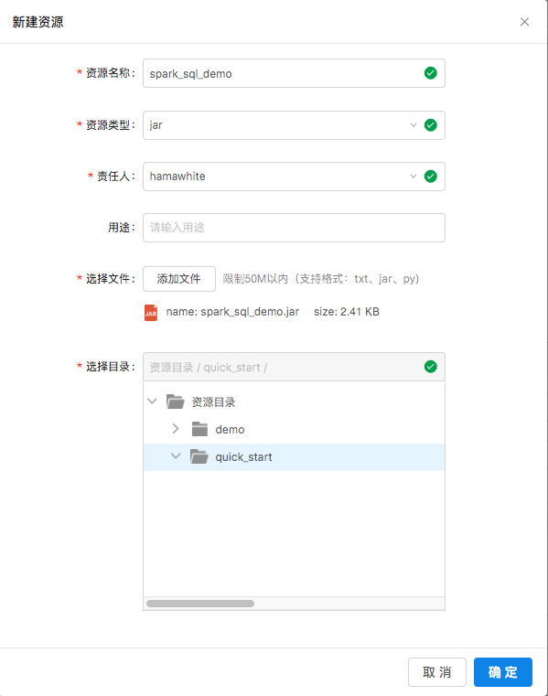

  <center>图 3-1-4-7上传资源</center>

4. 新建spark类型任务或脚本，配置对资源spark_sql_demo.jar的依赖，用spark-submit命令来提交作业。新建tmp_spark脚本，输入下述测试代码，任务详情如下图3-1-4-8所示。

   ```shell
   spark-submit --class com.dtwave.spark.sql.SparkSqlDemo --master yarn {spark_sql_demo.jar} ${dbName} ${tableName}
   ```

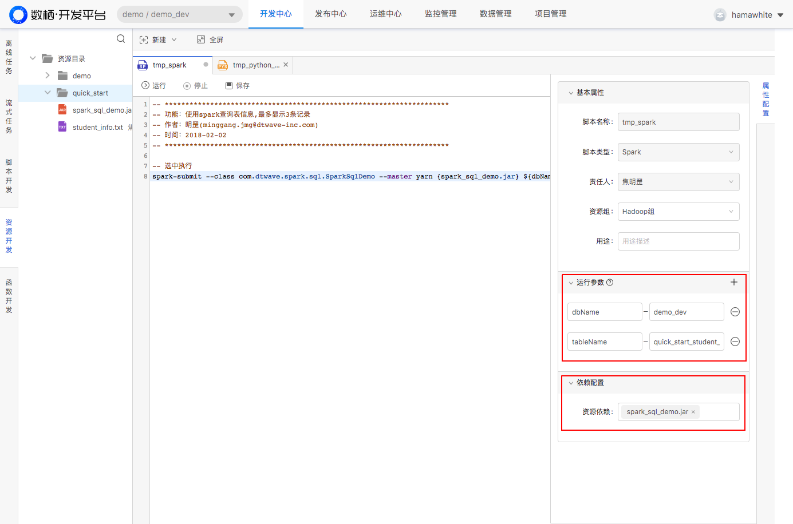<center>图 3-1-4-8 Spark任务</center>

###### 3.1.4.8 Hive2

Hive2类型用于书写Hive SQL，底层用HiveServer2，可快速查看Hive表中的数据，目前只能用于新建脚本。新建tmp_hive2脚本，输入本文**2.5 数据加工**中的代码，详情如下图3-1-4-9所示。

<center>图 3-1-4-9 Hive2任务</center>

###### 3.1.4.9 Presto

Presto类型用于书写Presto SQL，目前只能用于新建脚本。新建tmp_presto脚本，输入本文**2.5 数据加工**中的代码，详情如下图3-1-4-10所示。

<center>图 3-1-4-10 Presto任务</center>

###### 3.1.4.10 FlinkSQL

FlinkSQL类型用于书写Flink SQL，直接使用SQL来描述流计算的业务逻辑，并在任务属性配置中配置输入及输出后，即可完成一个流计算任务的开发。

1) 首先在数据源管理新建一个Kafka数据源。

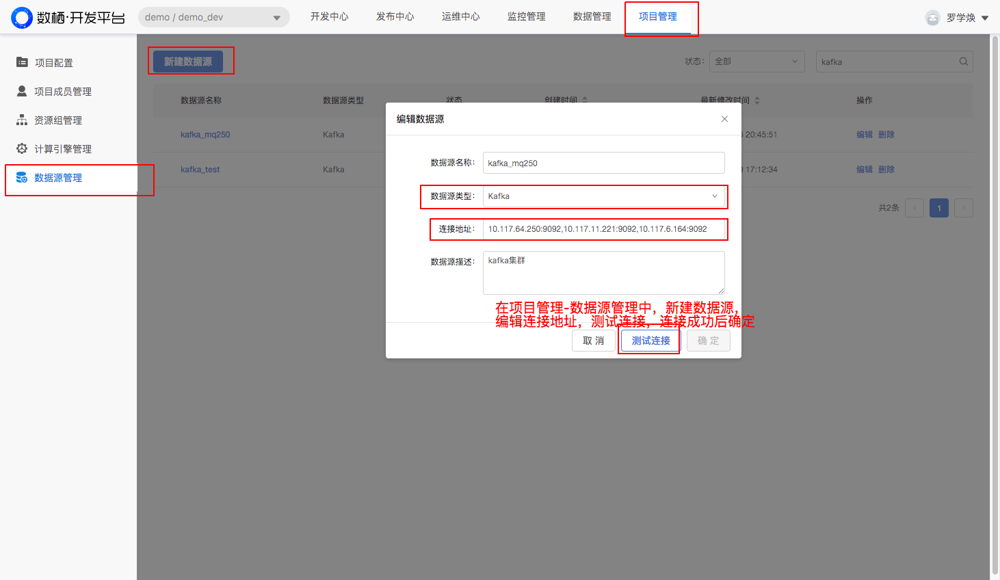

<center>图 3-1-4-11 流计算-新建Kafka数据源</center>

2) 新建一个Flink SQL类型的流计算任务。

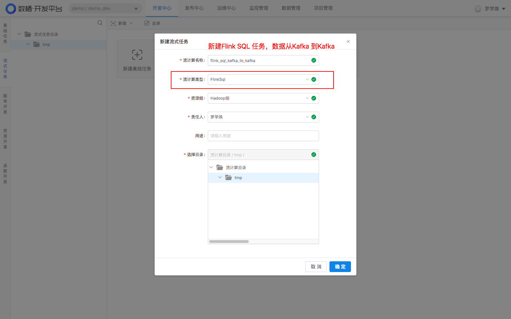

<center>图 3-1-4-12 流计算-新建FlinkSQL任务</center>

3) 在代码区域输入如下Flink SQL的代码。

```SQL
-- 最近三秒某商品下单金额总额
SELECT
    proName,
    TUMBLE_END(ptime, INTERVAL '3' SECOND) AS endRowtime,
    SUM(amount) AS totalAmount
FROM
    orders
WHERE
    orderId > 10
GROUP BY
    TUMBLE(ptime, INTERVAL '3' SECOND),
    proName
```
4）在右侧配置Flink SQL 的**输入**信息 ，下图设置输入是Kafka数据源并选择输入的Topic。


 <center>图 3-1-4-13 流计算-Flink SQL 配置输入</center>

5) 右侧配置Flink SQL 的**输出**信息。

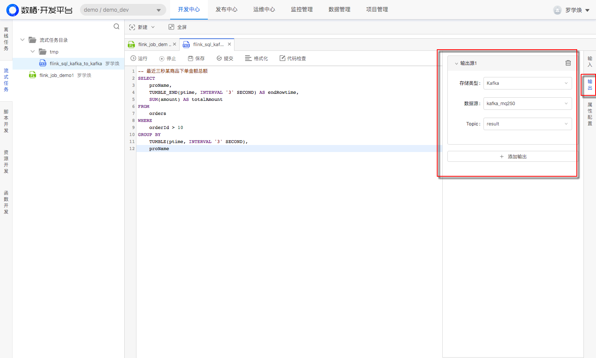

 <center>图 3-1-4-14 流计算-Flink输出配置</center>

6) 配置Flink SQL任务的属性信息(此步骤可略过)。

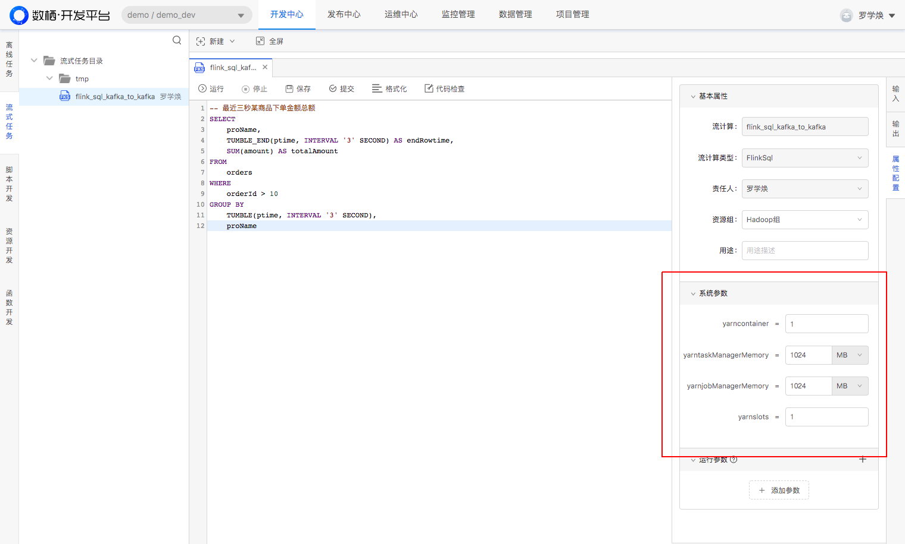

 <center>图 3-1-4-15 流计算-Flink属性配置</center>

至此，FlinkSQL任务新建完成，但输入源Kafka中仍无数据。下面步骤(7)提供两种方法来模拟Kafka数据生成。

7) 模拟kafka数据生成。

本文档已提供Kafka发送消息参考代码：[KafkaDataSimulation.java](https://github.com/dtwave/shuxi/blob/master/src/main/java/com/dtwave/flink/KafkaDataSimulation.java)，JAR包的下载地址：[flink_demo.jar](https://github.com/dtwave/shuxi/blob/master/libs/flink_demo.jar)。

- 方式一

  把Jar包上传到平台上，新建资源stream_job。

  新建一个Shell任务，并输入如下代码，配置资源依赖: stream_job.jar，kafka_param参数是Kafka的服务器地址，例如 "mq1:9092,mq2:9092,mq3:909"。点击运行后，便会启动kafka消息生成器往orders这个Topic持续发送消息。

  ```shell
  java -cp {stream_job.jar} com.dtwave.flink.KafkaDataSimulation ${kafka_param}
  ```


- 方式二：

  下载源码后,修改pom依赖provided级别为compile,设置程序入参后,直接运行KafkaDataSimulation类即可，成功运行会打印如下输出：

  ```sh
  {"_id":1,"orderId":1,"proName":"prt_1","amount":1,"orderTime":1519975807938}
  send successfully
  ```


8) 启动消息发送程序后，即可开始运行Flink SQL任务。

###### 3.1.4.11 Flink

1) 在Idea或者Eclipse中书写Scala或Java代码。本文档提供测试代码[FlinkDemo.scala](https://github.com/dtwave/shuxi/blob/master/src/main/scala/com/dtwave/flink/FlinkDemo.scala)。

2) 把上述代码打成Jar包或直接下载[flink_demo.jar](https://github.com/dtwave/shuxi/blob/master/libs/flink_demo.jar)，再上传到平台上，资源名是stream_job.jar。

3) 新建Flink类型的流计算任务。

4) 编写运行语句、配置流计算任务资源依赖。

```sbtshell
flink run -m yarn-cluster -yn 2 -c com.dtwave.flink.FlinkDemo {stream_job.jar} ${kafka_param}
```

5) 启动Kafka消息发送程序后，即可启动Flink 任务。

#### 3.2 发布中心

发布中心用于把开发环境demo_dev下任务、资源、函数发布到生产环境demo_prd，开发角色需要对已提交的任务创建发布包，然后管理员或者运维角色再进行审核。同意发布后，任务、资源或函数将会被**拷贝（或同步）**到生产环境demo_prd。在**开发中心**模块下，可在左上角切换到的 demo -> demo_prd环境中查看已发布的内容。

##### 3.2.1 创建发布包

> 注意: 操作此步骤前，请完成**3.1.3 提交**中指定任务、资源的依赖配置和提交操作。

任务提交后，会出现在**发布中心**的**创建发布包**页面上，选中将要发布的任务，点击右侧**创建发布包**，在弹框中自定义发布包名称，输入发布包描述，点击**确定**，完成创建发布包。选中student_info.txt、ddl_quick_start_student_info、quick_start_student_info、quick_start_student_statistics后，再**创建发布包**，如图3-2-1、3-2-2所示：

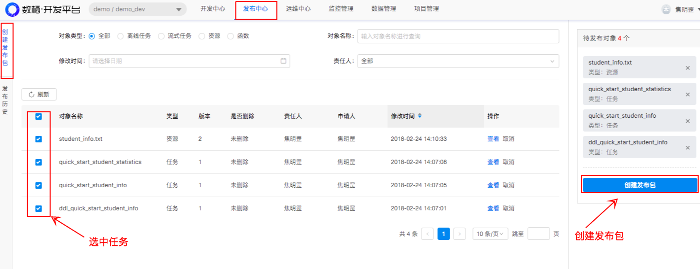<center>图 3-2-1 创建发布包 </center>

<center>图 3-2-2 创建发布包 </center>

##### 3.2.2 发布历史

在**发布历史**页面中，查看发布包的记录信息、发布状态，并可进行查看、同意和撤回操作。

- 查看

  查看发布包详情等信息，如图3-2-3 所示：

  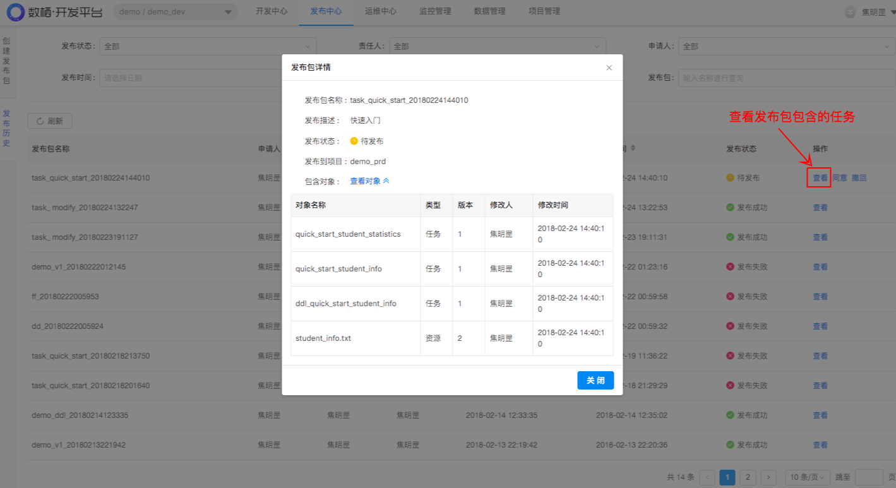<center>图 3-2-3 查看发布包</center>

- 发布

  点击**同意**后，发布包中任务、资源、函数将会发布到生产环境，其中任务将按天进行周期执行。发布成功后，可在**开发中心**模块下，可在左上角切换到的 demo -> demo_prd环境中查看已发布的内容。

  注意只有管理员和运维角色有发布权限，如图3-2-4 所示：

  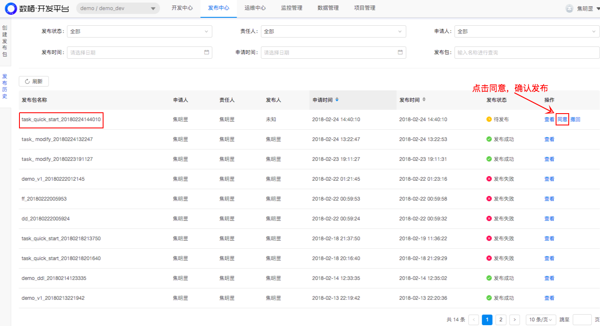<center>图 3-2-4 发布</center>

- 撤销

  点击**撤销**发布以后，任务会再次回到**创建发布包**页面下，如图3-2-5所示：

  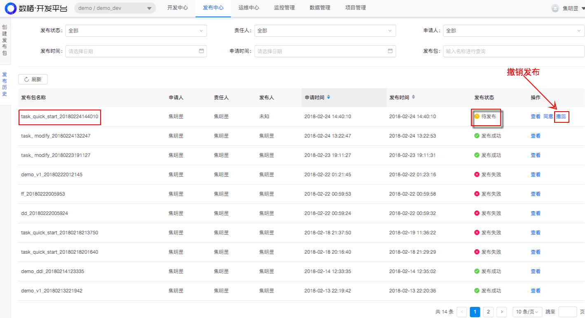<center>图 3-2-5 撤销发布包</center>

#### 3.3 运维中心

运维中心可查看任务的运行总览、每个实例的运行状态和日志，还有任务之间的依赖关系。同时对于生产环境(demo_prd)下的任务提供重跑、重跑下游、置成功、补数据、补下游等操作。运维中心模块一般用于生产环境中。

##### 3.3.1 运行总览

**运行总览**页面可查看每天离线任务和流式任务的运行统计信息，离线任务的运行统计如下图 3-3-1所示：

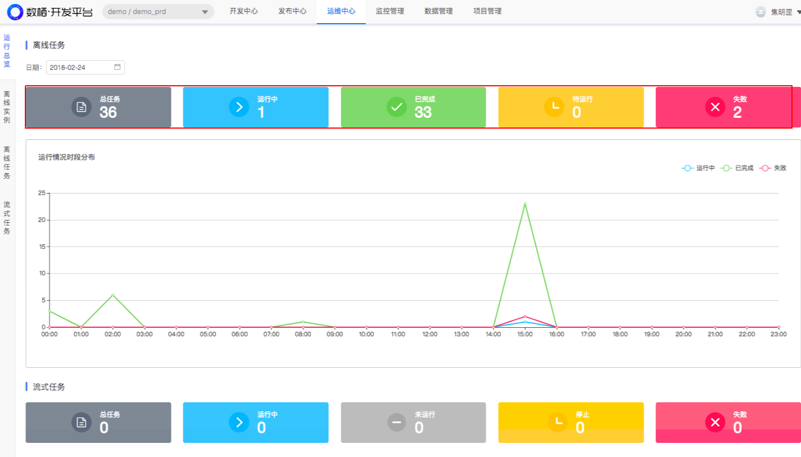<center>图3-3-1 离线任务总览</center>

流式任务的运行统计如下图 3-3-2所示：

<center>图3-3-2 流式任务总览</center>

##### 3.3.2 离线实例

**离线实例**页面分为两块内容，左侧是实例列表，可以根据日期、状态、负责人、名称进行筛选；右侧是实例信息，包含实例上下游、运行状态、基本信息等。右击任务实例，可以看到实例操作列表，包含: 展开父节点、展开子节点、查看运行日志、查看代码、终止、重跑、重跑下游、置成功。离线实例页如下图3-3-3 所示：

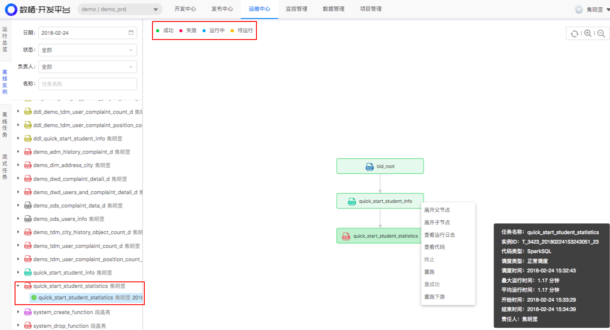<center>图3-3-3 离线实例页</center>

###### 3.3.2.1 展开父节点

点击任务实例，右击可以看到功能操作列表，点击展开父节点，在实例上方即可看到任务实例父节点信息。

###### 3.3.2.2 展开子节点

点击任务实例，右击可以看到功能操作列表，点击展开子节点，在实例下方即可看到任务实例子节点信息。

###### 3.3.2.3 查看运行日志

点击任务实例，右击可以看到功能操作列表，点击查看运行日志，弹出运行日志窗口，查看实例运行日志。运行日志页如下图3-3-4 所示：

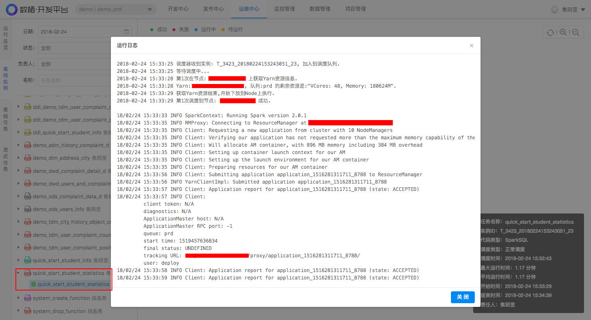<center>图3-3-4 任务日志页</center>

###### 3.3.2.4 查看代码

点击任务实例，右击可以看到功能操作列表，点击查看代码，弹出任务代码窗口，查看实例运行真实代码。任务代码页如下图3-3-5 所示：

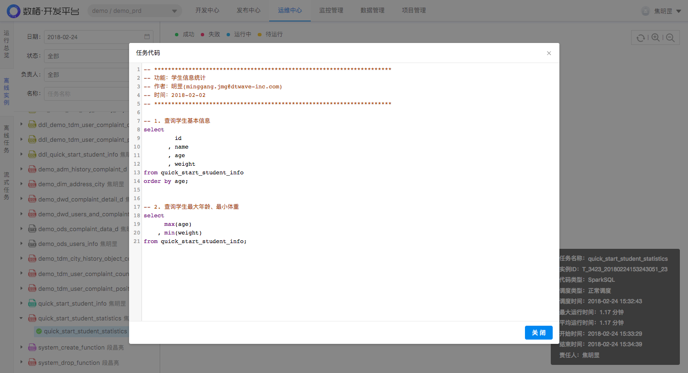<center>图3-3-5 任务代码页</center>

###### 3.3.2.5 终止

只可对等待运行、运行中状态的实例进行终止运行操作，进行此操作后，该实例将为失败状态。如果有下游实例，当前实例被终止后，下游所有实例都将会被停止，状态是STOPPED。

###### 3.3.2.6 重跑

重跑即实例重新运行一遍，不会再次进行实例化。当任务状态处于成功、失败时可以进行重跑。

###### 3.3.2.7 重跑下游

重跑下游会把实例和所有下游实例节点都重新运行一遍。当任务状态处于成功、失败时，可以进行重跑下游。

###### 3.3.2.8 置成功

将当前节点状态改为成功，并重跑下游所有的实例。当任务状态处于失败时，可以进行置成功操作。

##### 3.3.3 离线任务

离线任务页面分为两块内容，左侧为离线任务列表，可以根据任务名称进行筛选；右侧为具体任务信息，包含任务上下游依赖、基本信息等。

###### 3.3.3.1 补数据

生产环境下的任务才可以进行补数据操作，补数据操作页如下图3-3-6 所示，如果任务选择连续补多天数据时，每天会生成一个实例。

**自依赖**解释: 选择添加自依赖后，每天的实例会依赖于前一天的实例(串行关系)，只有前一天的实例运行完成后，当天的实例才会开始执行。如果未选择自依赖，每天的实例是并行的，会同时开始调度运行。

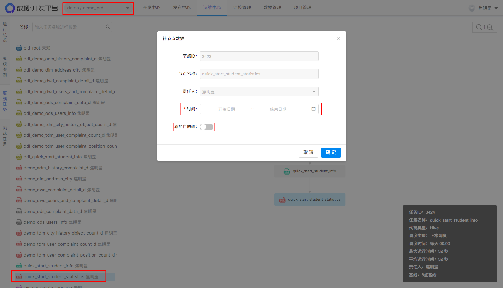<center>图3-3-6 补数据操作页</center>

###### 3.3.3.2 补下游

生产环境下任务才可以进行补下游操作，即补该任务及其所有下游任务。

##### 3.3.4 流式任务

暂空

#### 3.4 监控管理

##### 3.4.1 基线管理

在基线中定义最晚完成时间、告警方式及间隔，当任务配置基线后，如果在基线的最晚完成时间前未完成或者是失败状态，则会触发告警，给基线配置中的告警对象进行通知。下面演示新建基线。

1）进入**监控管理**—>**基线管理**界面，点击**新增基线**。

<center>图3-4-1 新增基线入口</center>

2）填写以下信息，*表示填项，下拉框如果不选，则为默认。

<center>图3-4-2 新增基线</center>

3）点击确定，出现系统的操作成功提示，即新建完成。

##### 3.4.2 基线告警

基线告警页面以列表形式显示已触发基线的所有任务列表，当把任务处理(一般是重跑)后，可手动把状态设置为已处理。

<center>图3-4-3 基线告警记录</center>

##### 3.4.3 数据质量告警

数据质量详细介绍见本文**3.5.3 数据质量**，数据质量告警页面以列表形式显示已触发数据质量监控规则的所有表。

 <center>图3-4-4 数据质量告警页</center>

#### 3.5 数据管理

**数据管理**是对生产过程中表数据进行查看、分析、监控等操作，主要包含全局概览、元数据管理、数据质量、数据目录、术语项管理等五个子功能。

##### 3.5.1 全局概览

**全局概览**展示租户下的元数据、数据质量、数据库&表等信息。

 <center>图3-5-1 全局概览</center>

##### 3.5.2 元数据管理

元数据管理中以列表形式展示当前用户下所拥有的库和表。

1）元数据主界面。

<center>图3-5-2 元数据管理界面</center>

2）元数据管理表详情，点击**详情**进入到表的详细信息界面。主要包括以下信息：

- 基本信息，包括中文名、表创建时间、DDL更新时间、数据更新时间、所属类目和描述。
- 存储信息，包括总存储量、昨日新增量、生命周期、存储方式。
- 明细信息，包含字段信息、分区信息、铲除信息、数据预览。

<center>图3-5-3 元数据表详细信息</center>

###### 3.5.2.1 生命周期

生命周期目前只能针对分区表，在表**存储信息**中可设置生命周期: 7天、30天、366天或永久，默认为永久。如果表的生命周期设置为7天，则只保存最近7天的数据，其他分区会被平台自动删除。

<center>图3-5-4 元数据表生命周期设置</center>

###### 3.5.2.2 数据血缘

平台会根据任务间的依赖关系，自动解析出表的血缘关系。因为只有生产环境的任务会按照依赖关系进行调度执行，因此血缘信息只针对于生产环境Hive库对应的表。血缘信息展示可以从任意一张表出发，向上追溯到数据的源头，可以向下追溯到依赖该表数据的最新产出的表的信息。demo_tdm_user_complaint_position_count_d表血缘如下图3-5-5 所示。

<center>图3-5-5 表血缘信息</center>

##### 3.5.3 数据质量

数据质量主要是对分区表数据的准确性和数据量进行校验，按照通用和自定义的规则进行校验和检查，并有可视化的工具对问题数据和任务进行记录和展示。因为只有生产环境的任务会按照依赖关系进行调度执行，因此血缘信息只针对于生产环境Hive库对应的表。


<center>图3-5-6 数据质量</center>

点击**配置规则**后，可配置表监控或字段监控。表级监控包括记录波动、每日新增存储量和总存储量，如下图3-5-7所示。字段级监控包括字段规范性和字段值两种，如下图3-5-8所示。


<center>图3-5-7 数据质量-表监控</center>


<center>图3-5-8 数据质量-字段监控</center>

数据质量报告。规则配置好后，第二天可以查看到数据质量报告，示例如下图3-5-9所示。

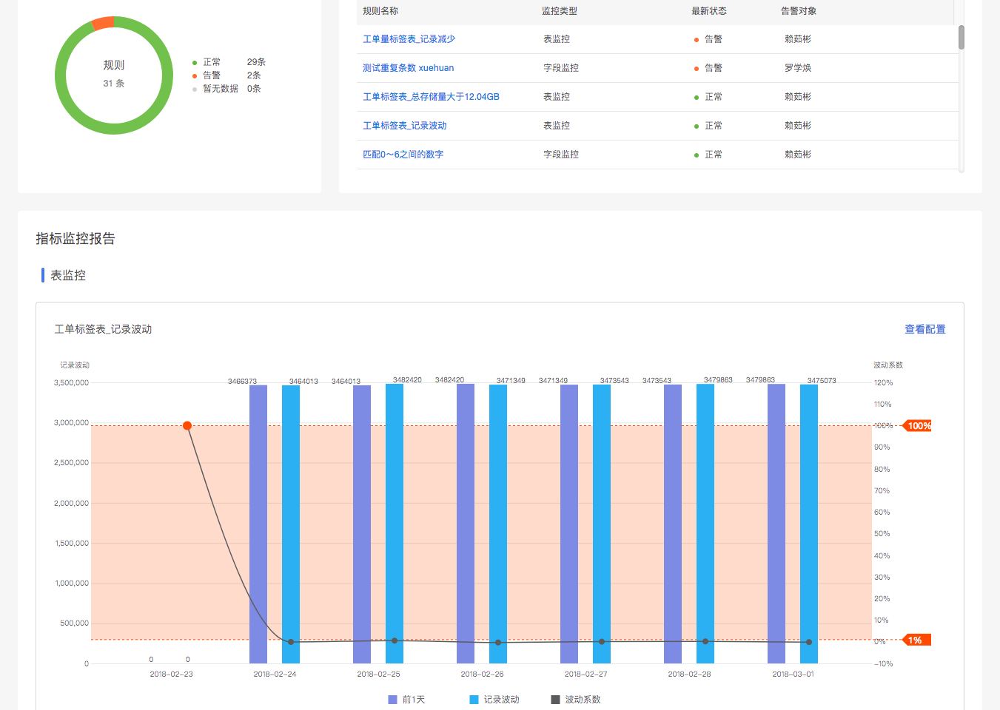

<center>图3-5-9 数据质量报告</center>

##### 3.5.4 数据目录

数据目录支持用户按照目录层级关系组织表，数据目录包含数据数目和标签类目两部分。数据类目一般针对于原始表，例如用户上传的数据表、数据同步后的表；标签类目一般针对于加工后的表，例如加工后学生兴趣属性表、学生成绩排序表等。

##### 3.5.5 术语项管理

术语项管理支持用户按照目录层级关系组织表字段，每个术语项可绑定多个表的字段。

#### 3.6 项目管理

##### 3.6.1 项目配置

项目配置是对项目工作空间下基本信息、功能权限、任务类型等配置操作，如图3-6-1 所示：

<center>图 3-6-1 项目配置界面</center>

##### 3.6.2 项目成员管理

项目成员管理（只有管理员的权限才有此选项）此界面可查看已添加的成员，添加项目成员和移出项目成员。目前项目空间下有四个成员角色: 开发、管理员、运维、访客，各成员角色请见[权限点划分](https://github.com/dtwave/shuxi/blob/master/doc/%E6%9D%83%E9%99%90%E7%82%B9%E5%88%92%E5%88%86.md)附件。如图3-6-2 所示：

<center>图 3-6-2 项目成员管理界面</center>

点击**添加成员**，出现成员下拉列表（此处成员必须和申请的帐户为同一租户），可选多个成员，选择成员完成后，分配相应的角色，点击确定。

##### 3.6.3 资源组管理

在资源组管理中可以新增资源组、更新资源组名称描述、管理资源组中的主机、查看主机信息(CPU  、内存信息、运行任务数)、对主机进行暂停/恢复。**当主机被处于暂停状态时，该主机上不可再运行任务，当主机运行数达到最大任务数时也不可再运行任务**。如图3-6-3 所示:

<center>图3-6-3 资源组管理页面</center>

管理主机页如图3-6-4 所示：

 <center>图3-6-4 主机管理页面</center>

##### 3.6.4 计算引擎管理

计算引擎管理中包含离线引擎、即席引擎、实时调度等信息，管理员或运维角色人员可以对引擎的基本信息进行编辑。实时调度信息中包含当前集群的CPU信息、内存信息和集群运行任务数等。

###### 3.6.4.1 离线引擎

离线引擎目前指hadoop集群，基本信息中包含hadoop集群的yarn地址、HDFS地址、**Hive数据库名**和调度队列等。

###### 3.6.4.2 即席引擎

即席引擎指Presto 集群，基本信息中包含workers数目、server地址、调度状态、运行查询数和阻塞查询数等。

##### 3.6.6 数据源管理

数据源管理是对项目空间下的数据源管理。数据源主要在开发中心DataSync类型的离线任务中使用，作为源头数据源或目的地数据源，在该页面可以对数据源进行新增、编辑和删除操作，数据源支持mysql、oracle、SQL Server、hive、ElasticSearch、Kafka、Greenplum、PostgreSQL、ODPS、MongoDB、HBase、OTS、ADS、HDFS等14种类型。

数据源管理列表页如图3-6-5 所示，可以对数据源进行新建、编辑、删除等操作。

<center>图3-6-5 数据源管理页面</center>

#### 3.7 高级功能
##### 3.7.1 新建项目空间

点击数栖平台右上角用户信息，右击选择添加项目，跳转到项目添加导航页，开始项目添加。导航页如图3-7-1 所示：

<center>图3-7-1 项目空间添加导航页</center>

- 新建项目

  点击导航页“开始操作”，进入创建项目页面，填写项目名称、责任人、项目描述。创建项目页如图3-7-2 所示：

  <center>图3-7-2 创建项目页</center>

- 添加资源组

  进入添加资源组页，填写资源组名称、添加主机列表和资源组描述。添加主机时，需要填写主机名称、ip地址(安装dubheNode插件的服务器地址)、任务运行最大并发数，点击确定会校验主机连通性。添加资源组界面如图3-7-3 所示：

  <center>图3-7-3 创建项目页</center>

- 配置计算引擎

  添加完资源组后，进入最后一步配置计算引擎，离线引擎中填写**Hadoop的Yarn地址、调度队列、Hive数据库名称、HDFS地址(高可用模式、非高可用模式)**，即席引擎填写**presto server服务地址**。当生产环境的引擎和开发环境相同时，可以直接点击“使用开发环境配置”进行快速操作。配置引擎页如图3-7-4 所示：

  <center>图3-7-4 配置计算引擎</center>


### 4. 案例实战

#### 4.1 背景介绍

本案例介绍如何使用数栖开发平台每天定时对业主信息和业主投诉内容等原始数据进行加工处理，以此实现对业主投诉信息数据的统计分析。

#### 4.2 数据开发流程介绍

数栖开发平台推荐使用数据仓库的概念进行数据开发，数据仓库分为ods、dwd、tdm、adm、dim层。各层任务如下：

- ods层存放原始数据，此案列ods层任务如下：
  - demo_ods_complaint_data_d
  - demo_ods_users_info

- dwd层存放清洗、初加工ods层数据后的数据，此案列dwd层任务如下：
  - demo_dwd_complaint_detail_d
  - demo_dwd_users_and_complaint_detail_d


- tdm层为数据标签层，通常在此层，标签化dwd层数据，此案列tdm层任务如下：
  - demo_tdm_city_history_object_count_d
  - demo_tdm_user_complaint_count_d
  - demo_tdm_user_complaint_position_count_d


- adm层为数据应用层，按照特定的业务组织标签数据，此案列adm层任务如下：
  - demo_adm_history_complaint_d


- dim层存放维表数据，此案列dim层任务如下：
  - demo_dim_address_city

案例实战任务依赖关系如图4-2-1所示

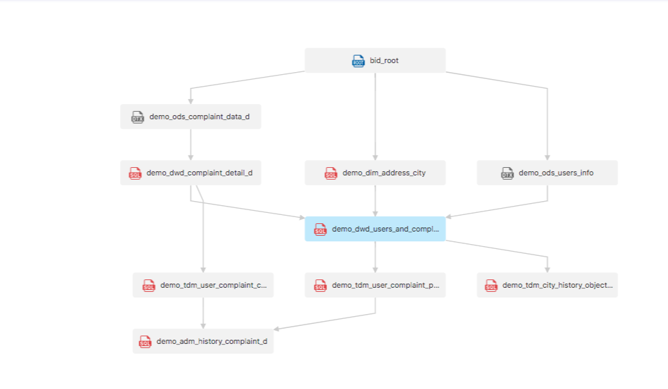

<center>图 4-2-1 任务依赖关系</center>

#### 4.3 开发

##### 4.3.1 DIM层

dim层存放维表数据，此层任务可以是定时任务，定时更新维表数据。本案例中dim层存放定时更新的小区和城市的映射关系数据，您需要先将维表数据上传到数栖开发平台，然后将数据导入表中。具体步骤如下:

1)  将把维表数据存储为txt格式的address_city.txt文件，且文件后缀名必须为txt。小区和城市的映射数据如下(字段之间以tab键分割):

```txt
金域湖庭  杭州
万科锦程  杭州
金色城市  杭州
万科红郡  上海
翡翠国际  深圳
```

2)  进入顶部菜单栏中的**开发中心**，在**资源开发**页面，创建demo目录，在demo目录下创建dim目录。在dim目录下新建资源，资源名address_city，资源类型txt，添加需要上传的address_city.txt文件，完成上传。如图4-3-1所示：

<center>图 4-3-1 创建资源</center>

3)  在**离线任务**页面中，创建demo目录，以及在demo目录下创建dim目录，在dim目录下新建ddl与job两个目录。

4)  在demo/dim/ddl目录下创建DDL任务，任务名为`ddl_demo_dim_address_city`，输入下面的建表语句，**运行**任务完成hive表创建工作。

**提示：**DDL任务调度类型默认为暂停调度，当任务发布以后，DDL任务立即运行且仅运行一次。

如图4-3-2所示：

<center>图 4-3-2 创建demo_dim_address_city表</center>

任务语句如下:


```sql
-- *********************************************************************
-- 功能：创建demo_dim_address_city表
-- 作者：明罡(minggang.jmg@dtwave-inc.com)
-- 时间：2018-02-02
-- *********************************************************************

-- drop table demo_dim_address_city;

create table if not exists demo_dim_address_city
(
      address string comment '业主小区'
  	, city    string comment '城市'
)
comment'小区和城市映射维表' 
row format delimited
fields terminated by'\t' 
lines terminated by'\n'
stored as textfile;
```

**注意**: 用户在数据开发中，不用指定数据库名。该任务在开发环境中执行的时候，表对应的库就是开发环境下的Hive库。发布到生产，在生产环境中执行的时候，表对应的库就是生产环境的Hive库。开发环境和生产环境对应的库分别如图4-3-3、4-3-4 所示：

<center>图 4-3-3 开发环境对应的hive库</center>

<center>图 4-3-4 生产环境对应的hive库</center>

5)  在demo/dim/job目录下创建SparkSQL任务，任务名为`demo_dim_address_city`，在界面右侧**属性配置**中资源依赖里选择上传的资源address_city.txt，在新建任务页面输入任务语句，完成数据导入工作。如图4-3-5所示：

<center>图 4-3-5 导入资源数据到demo_dim_address_city表</center>

任务语句如下：

```sql
-- *********************************************************************
-- 功能：导入维表数据
-- 作者：明罡(minggang.jmg@dtwave-inc.com)
-- 时间：2018-02-02
-- *********************************************************************

-- 导入数据
load data local inpath '{address_city.txt}' overwrite into table demo_dim_address_city;

-- 预览导入的数据
select *
from demo_dim_address_city
limit 10;
```
##### 4.3.2 ODS层

ods层存放原始数据，此层数据保持原貌，不做任何改动。本案例中ods层的数据来源于mysql中的业主投诉数据和业主信息，您需要将mysql中的数据同步到数栖平台hive库中。具体步骤如下:

1)  在mysql中创建demo_complaint_data表，并向其导入投诉数据，语句如下:

```sql
#创建demo_complaint_data表
create table demo_complaint_data (
    user_id     int
  , context     text
  , complaint_time  text
) ENGINE=InnoDB DEFAULT CHARSET=utf8;

#向demo_complaint_data插入数据
insert into demo_complaint_data (user_id, context, complaint_time)
values
(5, '你好，我家厨房的地漏堵着了', '2017-07-01'),
(5, '客服人员，卧室门吸吸不住，很影响使用', '2017-03-23'),
(4, '厨房窗户关不上', '2017-06-12'),
(4, '卫生间水管渗水，房子都不能住了', '2017-07-09'),
(3, '我要投诉，我家的进户门门框开裂严重，很长时间了还不来维修', '2017-08-01'),
(3, '投诉好久了，我家的主卧地板发黑，现在都没人管！', '2017-05-12'),
(2, '客服你好，厨房台面有点开裂', '2017-07-25'),
(2, '卫生间马桶下水慢，请快速解决', '2017-07-03'),
(1, '我家洗手间的门槛石缺损了，请尽快维修', '2017-07-23'),
(1, '浴室门上都是划痕', '2017-07-04'),
(1, '卫生间门把手松动，门都发不开，快点来维修', '2017-06-23'),
(1, '你好，卧室门有污渍，清理不掉', '2017-04-15');
```

2)  在mysql中创建demo_users表，并向其导入业主信息，语句如下:

```sql
#创建demo_users表
create table demo_users (
  user_id int,
  name text,
  age int,
  address text
) ENGINE=InnoDB DEFAULT CHARSET=utf8;

#向demo_users插入数据
insert into demo_users (user_id, name, age, address)
values
  (1, '张林静', 23, '金域湖庭'),
  (2, '王勇', 54, '万科锦程'),
  (3, '李志刚', 56, '金色城市'),
  (4, '赵晓丽', 23, '万科红郡'),
  (5, '杜孟娟', 67, '翡翠国际');
```

3)  使用数栖平台的DataSync任务将mysql中demo_complaint_data与demo_users表中的数据同步到数栖平台的hive表中。首先需要创建数据来源(数据从哪里来)，数据目的源(数据到哪里去)。

进入顶部菜单栏中的**项目管理**，导航至**数据源管理**页面，点击**新建数据源**。创建数据的来源`dtwave_demo_mysql`，以及数据的目的源`dtwave_demo_hive`两个数据源。分别如图4-3-6、4-3-7所示:

<center>图 4-3-6 创建dtwave_demo_mysql数据源</center>

<center>图 4-3-7 创建dtwave_demo_hive数据源</center>

4)  数据源创建完成以后，进行DataSync同步任务的开发。进入顶部菜单栏中的**开发中心**，导航至**离线任务**页面，在demo目录下创建ods目录，ods目录下新建ddl与job目录。

5)  在demo/ods/ddl目录下新建离线DDL任务，任务名称：`ddl_demo_ods_complaint_data_d`，在新建任务页面输入建表语句，点击**运行**，完成hive表创建工作。任务语句如下：


```sql
-- *********************************************************************
-- 功能：创建demo_ods_complaint_data_d表
-- 作者：明罡(minggang.jmg@dtwave-inc.com)
-- 时间：2018-02-02
-- *********************************************************************

-- drop table if exists demo_ods_complaint_data_d;

create table if not exists demo_ods_complaint_data_d
(
	  user_id			bigint comment '业主ID'
	, content			string comment '投诉内容'
	, complaint_time	string comment '投诉时间'
)
comment '业主投诉内容表'
partitioned by (ds string comment '按天分区,例如20160620')
stored as parquet;
```

同样地，在demo/ods/ddl目录下创建DDL任务，任务名称：`ddl_demo_ods_users_info`。按照上述操作完成demo_ods_users_info表创建。任务语句如下：


```sql
-- *********************************************************************
-- 功能：创建demo_ods_users_info表
-- 作者：明罡(minggang.jmg@dtwave-inc.com)
-- 时间：2018-02-02
-- *********************************************************************

-- drop table if exists demo_ods_users_info;

create table if not exists demo_ods_users_info
(
	  user_id	bigint comment '业主ID'
	, name		string comment '业主名字'
	, age		bigint comment '业主年龄'
	, address	string comment '业主小区'
)
comment '业主信息表'
stored as parquet;
```

6)  将mysql库中的demo_complaint_data表中的数据同步到hive库demo_ods_complaint_data_d中。在demo/ods/job目录下新建离线DataSync任务，任务名称:`demo_ods_complaint_data_d`。如图4-3-8、4-3-9、4-3-10、4-3-11所示。

<center>图 4-3-8 创建demo_ods_complaint_data_d任务(a)</center>


<center>图 4-3-9 创建demo_ods_complaint_data_d任务(b)</center>


<center>图 4-3-10 创建demo_ods_complaint_data_d任务(c)</center>

<center>图 4-3-11 创建demo_ods_complaint_data_d任务(d)</center>

任务内容如下: 

```txt
A.数据源配置
  源头表信息下的数据源为dtwave_demo_mysql,然后选择此数据源下的demo_complaint_data表。
  目的表信息下的数据源为dtwave_demo_hive,然后选择此数据源下的demo_ods_complaint_data_d表，分区信息ds=${bizDate}(bizDate为我们定义的时间分区，在此界面的右侧有属性配置，在运行参数下点击'添加参数'来定义我们的bizDate,在本演示中我们定义为bizDate = 20180202)，选择'写入前清理分区以有数据'，点击'下一步'
B.字段映射
  可以查看源表与目的表之间字段的映射关系，这里不做任何操作，点击下一步。
C.任务配置
  填上当出错超过0条记录，传输任务终止！
D.运行同步任务
  点击此任务页面上的运行任务，开始同步我们的数据。可以在下方看到任务运行日志。
```

同样地，将mysql库中的demo_users表中的数据同步到hive库demo_ods_users_info中。在demo/ods/job目录下新建离线DataSync任务，任务名称:`demo_ods_users_info`，运行同步。

##### 4.3.3 DWD层

ods层数据经过清洗，初加工以后存放在dwd层。本案例需要使用算法模型从业主投诉信息中获取投诉区域、投诉对象、投诉问题，然后合并dim层的数据，获得以业主对象的所有信息，具体步骤如下：

1) 采用算法模型，编写udf函数(代码在[Github](https://github.com/dtwave/shuxi)上，clone下来在本地编译成jar)，从投诉信息中获取投诉区域、投诉对象、投诉问题。

2) 将编译好的udf的jar包上传到**开发中心**的**资源开发**页面下的demo/dwd/udf目录下面，目录如果不存在则需创建，资源名：extract_complaint，资源类型：jar。

3) 在**开发中心**的**函数开发**页面下，创建demo/udf目录。点击udf目录，选择**新建函数**，函数名：extract_complaint，类名：com.dtwave.hive. ExtractComplaintUDF(类名全路径)，资源依赖：extract_complaint.jar。用途、命令格式、参数说明这三个参数选填。如图4-3-12所示：

<center>图 4-3-12 创建udf函数</center>

4）在**开发中心**的**离线任务**的demo目录下新建dwd目录，同样在dwd目录下新建ddl与job两个目录。

5）在demo/dwd/ddl目录下**新建离线DDL任务**，任务名为`ddl_demo_dwd_complaint_detail_d`，在任务页面输入建表语句，运行完成hive表创建工作。任务语句如下:


```sql
-- *********************************************************************
-- 功能：创建demo_dwd_complaint_detail_d表
-- 作者：明罡(minggang.jmg@dtwave-inc.com)
-- 时间：2018-02-02
-- *********************************************************************

-- drop table demo_dwd_complaint_detail_d;

create table if not exists demo_dwd_complaint_detail_d
( 
	  user_id			bigint comment '业主ID'
	, position			string comment '投诉位置'
	, object			string comment '投诉对象'
	, problem			string comment '投诉问题'
	, complaint_time	string comment '投诉时间'
)
comment '投诉详情信息'
partitioned by (ds string comment '按天分区,例如20160620')
stored as parquet;
```

同样地，在demo/dwd/ddl目录下创建`ddl_demo_dwd_users_and_complaint_detail_d`任务，任务类型为DDL，按照上述操作创建demo_dwd_users_and_complaint_detail_d表。任务语句如下:


```sql
-- *********************************************************************
-- 功能：创建demo_dwd_users_and_complaint_detail_d表
-- 作者：明罡(minggang.jmg@dtwave-inc.com)
-- 时间：2018-02-02
-- *********************************************************************

-- drop table demo_dwd_users_and_complaint_detail_d;

create table if not exists demo_dwd_users_and_complaint_detail_d
(
      user_id			bigint comment '业主ID'
	, name				string comment '业主姓名'
	, age				bigint comment '业主年龄'
	, address			string comment '业主小区'
	, city				string comment '城市'
	, position			string comment '投诉位置'
	, object			string comment '投诉对象'
	, problem			string comment '投诉问题'
	, complaint_time	string comment '投诉时间'
)
comment '业主信息及投诉详情'
partitioned by (ds string comment '按天分区,例如20160620')
stored as parquet;
```

6）在demo/dwd/job目录下**新建离线SparkSQL任务**，任务名为`demo_dwd_complaint_detail_d`，在此任务中使用创建的udf函数解析投诉信息，获取投诉位置、投诉对象、投诉问题。任务语句如下：

```sql
-- *********************************************************************
-- 功能：采用算法模型解析投诉信息,获取投诉位置,投诉对象,投诉问题！
-- 函数：extract_complaint('我家里卫生间的马桶漏水了') 返回 {"problem":"漏水","position":"卫生间","object":"马桶"}
-- 函数：get_json_object(extract_complaint('我家里卫生间的马桶漏水了'),'$.position') 返回 卫生间
-- 作者：明罡(minggang.jmg@dtwave-inc.com)
-- 时间：2018-02-02
-- ********************************************************************

insert overwrite table demo_dwd_complaint_detail_d partition(ds = '${bizDate}')
select   user_id
       , get_json_object(extract_complaint(content), '$.position') as position
       , get_json_object(extract_complaint(content), '$.object') as object
       , get_json_object(extract_complaint(content), '$.problem') as problem
       , complaint_time
from demo_ods_complaint_data_d
where ds = '${bizDate}';  
```

同样地，在demo/dwd/job目录下创建`demo_dwd_users_and_complaint_detail_d`任务，任务类型为SparkSQL，在此任务中通过多表join获得以业主为对象的所有信息。任务语句如下：

```sql
-- *********************************************************************
-- 功能：通过多表join获取业主信息及投诉详情
-- 作者：明罡(minggang.jmg@dtwave-inc.com)
-- 时间：2018-02-02
-- ********************************************************************

insert overwrite table demo_dwd_users_and_complaint_detail_d partition(ds = '${bizDate}')
select   b.user_id
       , b.name
       , b.age
       , b.address
       , c.city
       , a.position
       , a.object
       , a.problem
       , a.complaint_time
from
  ( select   user_id
   		   , position
           , object
           , problem
           , complaint_time
   from demo_dwd_complaint_detail_d
   where ds = '${bizDate}' ) as a
left join 
	demo_ods_users_info as b
on b.user_id = a.user_id
left join 
	demo_dim_address_city as c
on c.address = b.address;
```
##### 4.3.4 TDM层

tdm层为数据标签层，通常在此层，标签化dwd层数据。本案例需要获得标签：每个城市历史以来的各投诉对象总次数、各个业主历史以来的投诉总次数、各个业主详细信息及历史以来的投诉位置总次数。具体步骤如下：

1）在**开发中心**的**离线任务**的demo目录下新建tdm目录，同样在tdm目录下新建ddl与job两个目录。

2）创建标签表demo_tdm_city_history_object_count_d（每个城市历史以来的各投诉对象总次数）。在demo/tdm/ddl目录下新建离线DDL任务，任务名为`ddl_demo_tdm_city_history_object_count_d`，在新建任务页面输入建表语句。任务语句如下：


```sql
-- *********************************************************************
-- 功能：创建demo_tdm_city_history_object_count_d表
-- 作者：明罡(minggang.jmg@dtwave-inc.com)
-- 时间：2018-02-02
-- *********************************************************************

-- drop table demo_tdm_city_history_object_count_d;

create table if not exists demo_tdm_city_history_object_count_d
(
    city    string comment '城市'
  , object  string comment '投诉对象'
  , number  bigint comment '投诉次数'
)
comment '历史以来各个城市投诉对象次数统计'
partitioned by (ds string comment '按天分区,例如20160620')
stored as parquet;
```

同样，创建标签表demo_tdm_user_complaint_count_d（各个业主历史以来的投诉总次数），在demo/tdm/ddl目录下创建`ddl_demo_tdm_user_complaint_count_d`任务，任务类型为DDL。任务语句如下：


```sql
-- *********************************************************************
-- 功能：创建demo_tdm_user_complaint_count_d表
-- 作者：明罡(minggang.jmg@dtwave-inc.com)
-- 时间：2018-02-02
-- *********************************************************************

-- drop table demo_tdm_user_complaint_count_d;

create table if not exists demo_tdm_user_complaint_count_d
(
	  user_id			bigint comment '业主ID'
	, complaint_number	bigint comment '投诉次数'
)
comment '业主投诉总次数'
partitioned by (ds string comment '按天分区,例如20160620')
stored as parquet;
```

创建标签表demo_tdm_user_complaint_position_count_d（各个业主详细信息及历史以来的投诉位置总次数），在demo/tdm/ddl目录下创建`ddl_demo_tdm_user_complaint_position_count_d`任务，任务类型为DDL。任务语句如下：


```sql
-- *********************************************************************
-- 功能：创建demo_tdm_user_complaint_position_count_d表
-- 作者：明罡(minggang.jmg@dtwave-inc.com)
-- 时间：2018-02-02
-- *********************************************************************

-- drop table demo_tdm_user_complaint_position_count_d;

create table if not exists demo_tdm_user_complaint_position_count_d
(
	  user_id			bigint comment '业主ID'
	, name				string comment '业主姓名'
	, age				bigint comment '业主年龄'
	, address			string comment '业主小区'
	, city				string comment '城市'
	, position			string comment '投诉位置'
	, position_number	bigint comment '投诉次数'
)
comment '业主投诉位置次数统计'
partitioned by (ds string comment '按天分区,例如20160620')
stored as parquet;
```

3）统计每个城市历史以来的各投诉对象总次数。在demo/tdm/job目录下创建SparkSQL任务，任务名为`demo_tdm_city_history_object_count_d`。任务语句如下：

```sql
-- *********************************************************************
-- 功能：统计每个城市历史以来的投诉对象总次数
-- 作者：明罡(minggang.jmg@dtwave-inc.com)
-- 时间：2018-02-01
-- *********************************************************************

insert overwrite table demo_tdm_city_history_object_count_d partition (ds = '${bizDate}')
select   city
       , object
       , count(object) as number
from demo_dwd_users_and_complaint_detail_d
where ds <= '${bizDate}'
group by city,
         object
order by count(object);
```

4）统计各个业主历史以来的投诉总次数。在demo/tdm/job目录下创建SparkSQL任务，任务名为`demo_tdm_user_complaint_count_d`，任务语句如下：

```sql
-- *********************************************************************
-- 功能：统计各个业主历史以来的投诉总次数
-- 作者：明罡(minggang.jmg@dtwave-inc.com)
-- 时间：2018-02-01
-- *********************************************************************

insert overwrite table demo_tdm_user_complaint_count_d partition(ds = '${bizDate}')
select   user_id
       , count(user_id) as number
from demo_dwd_complaint_detail_d
where ds <= '${bizDate}'
group by user_id;

```

5）获取各个业主详细信息及历史以来的投诉位置总次数。在demo/tdm/job目录下创建SparkSQL任务，任务名为demo_tdm_user_complaint_position_count_d，任务语句如下：

```sql
-- *********************************************************************
-- 功能：获取各个业主详细信息及历史以来的投诉位置总次数
-- 作者：明罡(minggang.jmg@dtwave-inc.com)
-- 时间：2018-02-01
-- *********************************************************************

insert overwrite table demo_tdm_user_complaint_position_count_d partition (ds = '${bizDate}')
select distinct   a.user_id
                , a.name
                , a.age
                , a.address
                , a.city
                , a.position
                , count(position) over(partition by user_id,position) as number
from demo_dwd_users_and_complaint_detail_d a
where ds <= '${bizDate}';
```

##### 4.3.5 ADM层

adm层为数据应用层，按照特定的业务组织标签数据。本案例中此层演示如何统计各个业主详细信息、各个业主历史以来的各投诉位置总次数及投诉总次数，具体步骤如下：

1）在**开发中心**的**离线任务**的demo目录下新建adm目录，在adm目录下新建ddl与job两个目录。

2）创建标签表demo_adm_history_complaint_d。在demo/adm/ddl目录下创建DDL任务，任务名为`ddl_demo_adm_history_complaint_d`，在新建任务页面输入建表语句。任务语句如下:


```sql
-- *********************************************************************
-- 功能：创建demo_adm_history_complaint_d表
-- 作者：明罡(minggang.jmg@dtwave-inc.com)
-- 时间：2018-02-02
-- *********************************************************************

-- drop table demo_adm_history_complaint_d;

create table if not exists demo_adm_history_complaint_d
(
      user_id			bigint comment '业主ID'
	, name				string comment '业主姓名'
	, age				bigint comment '业主年龄'
	, address			string comment '业主地址'
	, city				string comment '城市'
	, position			string comment '投诉位置'
	, position_number	bigint comment '投诉位置次数'
	, complaint_number	bigint comment '总投诉次数'
)
comment '业主投诉位置以及投诉总次数'
partitioned by (ds string comment '按天分区,例如20160620')
stored as parquet;
```

3）统计各个业主详细信息、各个业主历史以来的各投诉位置总次数及投诉总次数，在demo/adm/job目录下创建SparkSQL任务，任务名为`demo_adm_history_complaint_d`，任务语句如下：

```sql
-- *********************************************************************
-- 功能：统计各个业主详细信息、各个业主历史以来的各投诉位置总次数及投诉总次数
-- 作者：明罡(minggang.jmg@dtwave-inc.com)
-- 时间：2018-02-02
-- ********************************************************************

insert overwrite table demo_adm_history_complaint_d partition (ds = '${bizDate}')
select   a.user_id
       , a.name
       , a.age
       , a.address
       , a.city
       , a.position
       , a.position_number
       , b.complaint_number
from demo_tdm_user_complaint_position_count_d as a
join demo_tdm_user_complaint_count_d as b 
on a.user_id = b.user_id
and a.ds = '${bizDate}'
and b.ds = '${bizDate}';

-- 预览数据
select *
from demo_adm_history_complaint_d
where ds = '${bizDate}'
limit 10;
```
##### 4.3.6 配置基线

基线介绍详见本文[3.4.1 基线管理](#3.4.1)，案例配置基线步骤如下：

1) 创建基线，名称为“8点基线”，告警方式为邮件

 <center>图 4-3-13 新增基线 </center>

2) 配置基线 

一般只需对项目中关键任务配置基线，本案例中对tdm层的demo_tdm_city_history_object_count_d、demo_tdm_user_history_object_count_d、demo_tdm_user_complaint_position_count_d 三个任务配置基线，在任务的左侧属性配置->基线配置中选择刚才创建的基线。

#### 4.4 发布

在开发环境下完成的任务、上传的资源、新建的udf函数，测试无误后，可以发布到生产环境依据设置的调度时间进行周期调度运行，**注意**：DDL任务也需要发布，当DDL任务发布以后，DDL任务立即运行且仅运行一次。步骤如下：

1）因为我们使用的是开发环境下的数据源，需要新建生产环境的数据源，如图4-4-1所示。

<center>图 4-4-1 发布任务</center>

2）任务在提交之前确保已经配置完成所需要的运行参数、调度配置、**依赖配置**(参见图4-2-1)、基线配置（如果任务不需要配置某项参数则不用配置，DDL任务只需配置上游任务），且测试无误后，点击各个任务页面上的**提交**，填写好提交信息(非必需)，进行提交任务。

**注意**：对于没有任务依赖的任务，上游任务为bid_root；对于资源、udf函数，系统会默认提交到发布包列表页面。

3）在**发布中心**的**创建发布包**页面下，选中我们提交的任务、资源、函数，这时在右侧的**待发布对象**中会看到我们选中的任务、资源、函数，然后点击创建发布包，填写发布包名称、发布描述，完成创建发布包。 

4）具有发布权限的管理员或运维人员，可在**发布中心**的**发布历史**下发布、撤销发布包。如图4-4-3所示：

 <center>图 4-4-3 发布任务</center>

#### 4.5 运维

在生产环境的运维中心下可以通过运行总览页可以查看离线任务、流式任务的统计信息，包含运行总任务数、当前时间任务运行数、已完成的任务数、待运行任务数、失败任务数等信息。还可以在离线实例页面查看实例上下游依赖、实例运行状态、实例基本信息等，进行展开父节点、展开子节点、查看运行日志、查看代码、终止、重跑、重跑下游、置成功等操作。具体操作介绍详见本文[3.3 运维中心](#3.3)

#### 4.6 数据管理
##### 4.6.1 配置数据质量

在数据质量中对demo_prd库中demo_adm_history_complaint_d表进行每日新增存储量进行监控配置，配置如下图4-6-1 所示，其他数据质量规则配置详见本文[3.5.3 数据质量](#3.5.3)

<center>图4-6-1 数据质量设置</center>

##### 4.6.2 配置生命周期

在表详情中生命周期信息中，选择需要的周期，点击“确定”按钮，出现系统提示“操作成功”，即设置成功。

<center>图4-6-2 元数据表生命周期设置</center>

##### 4.6.3 查看数据血缘

在元数据管理中，查看生产环境中demo_tdm_user_complaint_position_count_d表的血缘信息。如图4-6-3所示：

<center>图 4-6-3 查看数据血缘</center>

